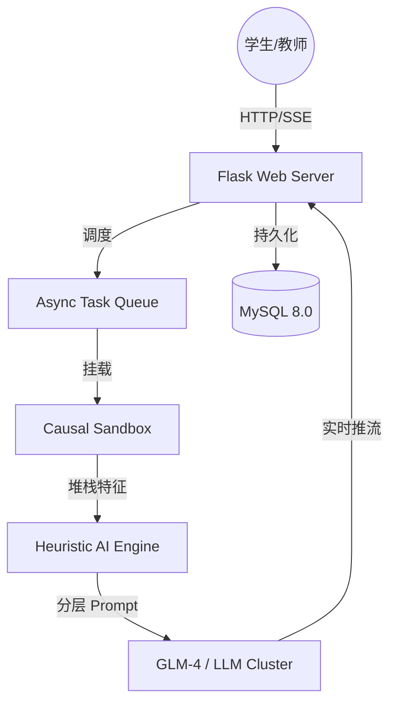

<div align="center">

# CodeSense 酷森思

**基于因果隔离沙箱与启发式大模型的智能编程教育平台**

[](https://github.com/XiaoCow666/CodeSense)
[](https://python.org)
[](https://flask.palletsprojects.com)
[](https://mysql.com)
[](LICENSE)
[](https://github.com/XiaoCow666/CodeSense/stargazers)
[](https://github.com/XiaoCow666/CodeSense/commits)

</div>

---

## 🚀 项目简介

CodeSense 酷森思是专为高校编程教育设计的**第二代智能评测平台**。我们摒弃了传统 OJ 仅反馈 `Wrong Answer` 的冰冷体验，也告别了初阶 AI 直接给出答案的“投喂式”教育。

通过**因果隔离沙箱 (Causal Sandbox)** 捕捉程序运行细节，配合**启发式大模型 (Heuristic LLM)** 生成由浅入深的逻辑引导，CodeSense 将每一次 Bug 报错转化为学生的成长契机。

### 🌟 核心技术亮点

- **因果隔离沙箱 (Causal Sandbox)**：轻量级进程隔离，毫秒级捕获堆栈异常、内存溢出与死循环，支持多语言动态编译。
- **启发式 AI 导师 (Heuristic AI)**：基于 AST 状态感知的四层分级提示词矩阵。只给思路，不给代码，强制诱导学生自主思考。
- **异步高并发引擎 (Async Core)**：任务调度与 Web 后端解耦，支持数百名学生同时提交请求，评测过程动态进度实时可见。
- **数理能力画像 (Scoring Model)**：基于贝叶斯思想的权重评估模型，从稳定性、密度、进步梯度等多维量化编程素养。

---

## 📸 系统亮点展示

| 动态异步评测 | 启发式 AI 反馈 |
|----------|----------------|
|  |  |
| *实时反馈编译、静态分析、用例执行进度* | *Markdown 渲染的诱导性逻辑提示* |

| 多维能力雷达 | 班级全局监控 |
|--------------|-------------|
|  |  |
| *基于历史提交的量化成长轨迹* | *教师/管理员端的学情大数据驾驶舱* |

---

## 🛠️ 技术架构



| 类别 | 技术方案 | 创新说明 |
|------|------|------|
| **评测安全** | Subprocess Sandbox | 多层隔离防御（时间/空间/行为拦截/权限隔离） |
| **异步处理** | ThreadPool + Queue | 彻底解决 AI 调用延迟导致的页面阻塞 |
| **交互增强** | SSE (Server-Sent Events) | 类似 ChatGPT 的流式反馈体验 |
| **代码编辑器** | Monaco Editor | 工业级 IDE 编辑体验，支持语法高亮与折叠 |
| **工程化** | Dotenv + Decoupling | 代码与配置彻底分离，支持生产级一键部署 |

---

## 📦 快速启动

### 1. 环境准备
```bash
# 克隆仓库
git clone https://github.com/XiaoCow666/CodeSense.git
cd CodeSense

# 安装依赖
pip install -r requirements.txt
```

### 2. 配置部署
```bash
cp env.example .env
# 编辑 .env 设置您的 DATABASE_URL, ZHIPU_API_KEY, SECURE_COOKIES=false
```

### 3. 安装沙箱依赖 (Linux/ECS)
```bash
sudo apt update && sudo apt install g++ -y
```

### 4. 运行
```bash
python app.py
```

---

## 📈 更新日志

### [v0.4.0] - 2026-03 - 工业级重构
- **[重大革新]** 上线“因果隔离沙箱”，支持真实用例执行与异常截获。
- **[重大革新]** 引入“启发式引导提示词”，AI 从“工具人”升级为“导师”。
- **[优化]** 实现异步评测系统，前端新增实时进度条显示。
- **[安全]** 实现代码与配置彻底分离，支持 `.env` 敏感信息隐藏。
- **[修复]** 解决云服务器 HTTP 环境下的登录重定向循环问题。
- **[移除]** 舍弃了旧版的 TextCNN 评分模型，全面拥抱可解释的语义评估。

---

## 🤝 许可证与贡献

CodeSense 采用 [MIT License](LICENSE)。

感谢沈阳航空航天大学网络工程专业的试点支持。
如有任何问题，欢迎提交 Issue 或访问 [saucodesense.com](http://saucodesense.com)。
