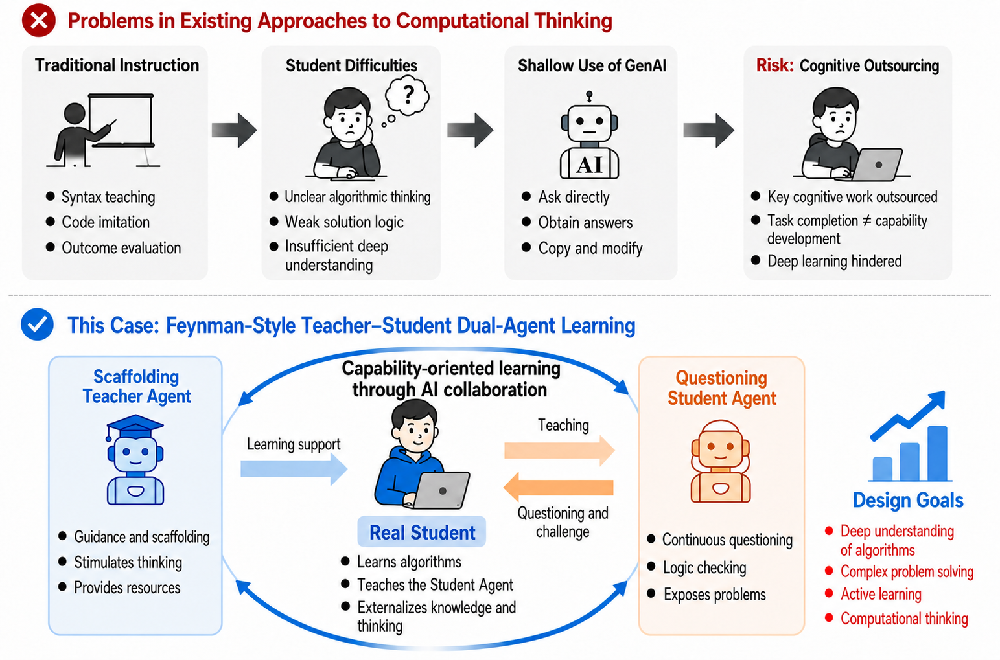
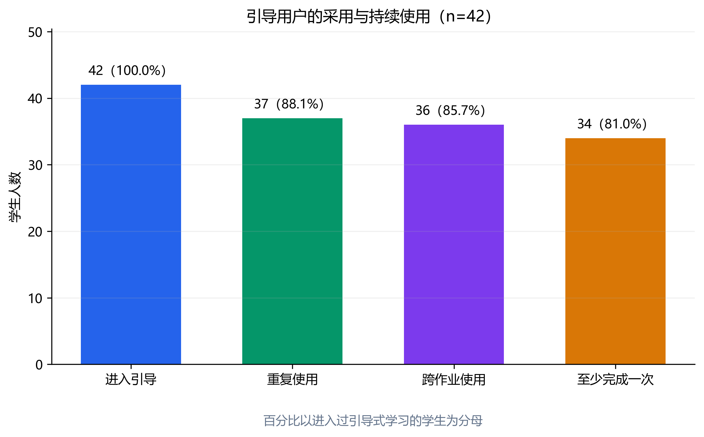
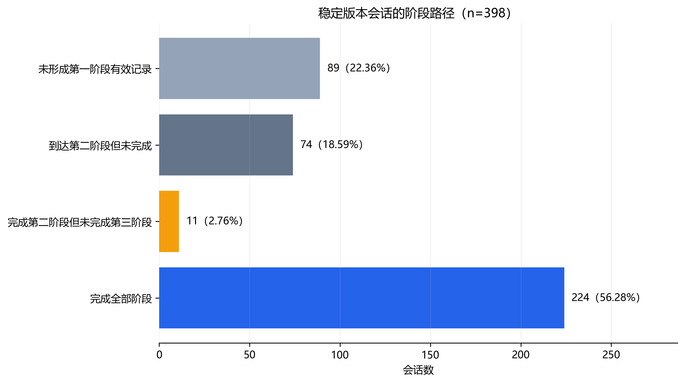
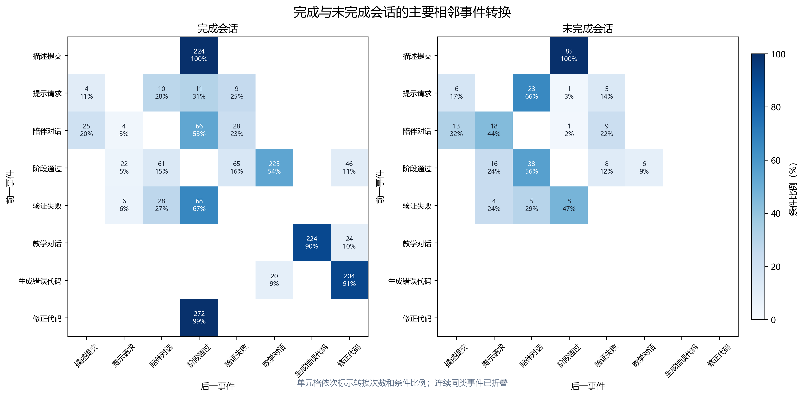
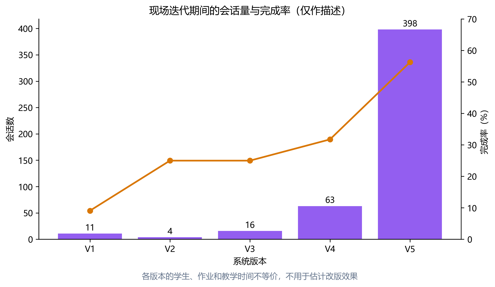

# 生成式AI支持的三阶段程序设计引导：活动设计、课堂采用与行为路径

## 摘要

生成式AI容易替学生完成程序设计中的分析、验证和调试，因而需要把它放进受约束的学习活动，而不是直接放在答案终点。本文设计了一种状态驱动的三阶段引导方法：学生先外化算法思路，再识别并重构代码，最后向虚拟学生讲解算法并修正错误代码。智能体只依据当前会话状态调整提示、诊断或追问。研究场景为数据结构课程设计，学生可直接编码，也可进入引导；教师鼓励体验，相关表现约占课程设计成绩的10%，得分门槛较低。2026年7月16日导出的匿名数据涉及117名学生、492次引导会话和9940条阶段日志。路径分析限定于相对稳定版本的398次会话，提交关联分析包含994个学生—作业对。42名学生使用过引导功能，其中37名重复使用，36名跨作业使用。稳定版会话中，224次完成全部阶段，89次没有形成第一阶段有效记录，74次停在第二阶段，11次进入第三阶段后未完成。完成会话第三阶段活跃时长中位数为5.86分钟，对话轮数中位数为7轮。首次提交前无暴露、未完成暴露和完成暴露的满分率分别为71.83%、59.46%和65.57%；控制学生与作业固定效应并按学生聚类后，各主要关联的95%置信区间均跨越0，三水平模型仅有32名学生提供个体内暴露变化。本文的创新对象是三阶段学习方法，平台用于实施活动规则并记录过程。现有数据支持课堂采用和行为路径分析，不支持学习增益或因果判断。

## 关键词

生成式人工智能；程序设计教育；引导式学习；学习分析；可教智能体；行为路径

## 1 问题提出

生成式AI可以直接给出代码、定位错误并生成解释，学生即使完成作业，也未必经历了问题分析、代码组织和错误修正。Becker等据此提出，AI代码生成正在改变程序设计任务中由学生承担的认知工作[1]。李海峰、王炜对作业设计与评价的讨论也提醒教师关注人机交互过程和表现性活动[2]。本研究由此追问：AI应当怎样参与学习活动，学生仍需完成哪些认知操作？

Wang等在45名本科生中开展了6周准实验，比较AI-Agent支持的协作学习与常规计算机支持协作学习，并测量成绩、自我效能、认知负荷和兴趣[3]。这项研究写清了分组、周期和结果测量。本文没有同类对照条件，只分析自然使用形成的日志。

另一些研究把智能体用于学习者模拟。Agent4Edu利用画像、记忆和行动模块生成学习者响应[4]，Classroom Simulacra依据学生历史与课程材料模拟在线学习行为[5]。Yusuf等对92篇高等教育对话智能体研究的综述，则从教学目的、角色和交互方式界定智能体[6]。本文面对真实学生，研究对象是会话内的活动调节，不生成合成学习者，也不保存跨作业画像。

国内与本研究最接近的是孙丹等对36名大学生生成式AI编程学习行为的分析。该研究结合屏幕记录、行为编码、滞后序列分析和认知网络分析，呈现学生提问与编码行为的联系[7]。本文研究预先规定的思路外化、代码重构和讲解纠错活动，关注真实学生如何进入、推进或中止这条活动链。吴林静等从学习分析视角讨论了编程过程证据[8]；周雪涵等进一步区分大学生使用生成式AI的态度、行为与能力[9]。因此，点击、提示、对话和阶段完成只能描述平台内行为，不能替代能力测量。

本文把三个阶段概括为“表达—辨识—讲解与修正”的活动链。“活动链”是对学习方法的归纳，不是新理论；平台只是实施和记录这套方法的载体。研究使用课程运行后导出的匿名日志，回答以下问题：

RQ1：学生在真实课程中如何采用和重复使用三阶段引导？

RQ2：在相对稳定版本中，会话沿哪些阶段路径推进，完成与未完成会话的过程摩擦和事件转换有何差异？

RQ3：首次提交前无引导、未完成引导和完成引导的学生—作业对，在提交表现上呈现何种关联？

这三个问题均为描述或关联问题。研究没有设置对照组，也没有前测、后测和迁移测验，不检验学习增益。

## 2 理论基础与活动设计

### 2.1 从答案生成转向状态驱动的活动调节

生成式AI既能给出答案，也能提示、追问、模拟同伴或反馈。教育对话智能体的角色不同，学习者需要完成的任务也随之改变[6]；人机协同设计同样需要交代分工、角色和自主度[10]。本研究把智能体限制在既定活动规则内，使其根据学生当前状态调节下一步任务，而不让模型决定教学目标或替学生完成整段程序。

本文所称智能体，是在既定教学角色与活动规则下，读取学生当前会话状态，并据此生成提示、诊断或追问的生成式人工智能组件。其自适应发生在单次会话内部，不等同于跨作业学习者建模。这里的“状态驱动”是一种会话内微观自适应：系统依据学生已经提交的回答、提示次数、阶段进度、错误类型和对话历史选择后续反馈，不保存跨作业学生画像，也不进行跨作业记忆。

本系统没有把三阶段写成固定的认知等级。设计上的递进体现在学生责任变化：第一阶段表达自己的解法；第二阶段识别程序结构并完成缺口；第三阶段面向一个会追问、也会犯错的虚拟学生讲解。三阶段共享同一道作业题，减少任务切换，但分别留下不同的行为证据。图1从问题情境、角色分工和设计目标三个层面概括整体框架；其中列出的能力是活动设计目标，不是本文已经验证的学习结果。

图1 问题情境与双智能体协同学习设计框架

### 2.2 思路外化

自我解释不是简单复述题目。Chi等发现，学习者对样例中的规则、条件和推理关系作出解释，与仅重读材料不同[11]；Renkl及后续研究进一步表明，解释方式和质量存在明显差异[12-13]。在线提示可以改变自我解释过程，也可能造成中断[14]。

第一阶段据此要求学生分题说明算法步骤和依据，并在必要时获取提示。平台可记录回答提交、提示请求和阶段通过，却不保存用于本研究的回答正文。因此，本文只能把该阶段称为“思路外化活动”，不能判断解释是否包含正确概念、不变量或复杂度依据。

### 2.3 代码重构

Parsons Problems通常把程序拆成打乱的代码块，由学习者恢复顺序或层级。系统综述显示，这类任务能降低空白页编码负担，但代码块、干扰项、缩进和反馈形式会改变任务性质[15]。CodeSense早期版本曾采用拖拽积木，稳定版改为逐步选择和填空。本文因此使用较宽的“代码重构”，不把稳定版等同于标准Parsons Problems。

第二阶段要求学生依据第一阶段思路辨识代码结构、完成选项或空缺，并接受自动验证。日志中的验证失败、再次作答和阶段通过可以描述重构过程，但不能区分概念错误、界面误操作和试探性点击。

### 2.4 讲解纠错

learning-by-teaching研究关注学生在准备讲授和实际讲授时组织知识的过程[16]。可教智能体把学习对象变成需要学生教授的角色，学生可能因承担“让对方学会”的责任而投入更多努力[17]。学生如何理解智能体的能动性也会影响交互[18]，角色设定本身不能保证学习发生。

第三阶段让虚拟学生围绕算法连续追问，随后生成含有问题的代码，由学生定位并修正。平台记录对话轮次和错误代码修正事件，不向本研究数据包导出对话正文与完整代码。对话轮数只说明发生了交互，不能直接解释为协商质量或深层理解；基于IRF理论的人机对话研究也表明，对话质量需要结合话轮功能判断[19]。

### 2.5 研究问题

RQ1对应课堂采用层面，关注多少学生进入、是否重复使用以及是否跨作业使用。RQ2对应过程层面，关注路径、活跃时长、提示、验证失败、对话和修正。RQ3对应结果关联层面，使用严格的首次提交前时间边界，并同时呈现原始比例与控制学生、作业不变差异后的模型估计。三者依次回答“有没有用”“怎么用”“与提交表现如何共变”，不把最后一个问题写成因果效果。

## 3 研究设计

### 3.1 教学情境与参与方式

数据主要来自沈阳航空航天大学2024级网络工程1、2班的数据结构课程设计。课程要求学生完成若干编程作业。学生可以直接进入代码编辑与提交，也可以点击引导式学习入口。教师在课程群中鼓励学生尝试该功能，目的包括训练算法表达并积累系统运行反馈。

引导式学习相关表现约占课程设计成绩的10%。这一部分门槛较低，多数学生完成一次体验即可获得8—9分，未体验者可能为0分，但不会仅因此不及格。它不是强制流程，但使用选择受到分数鼓励。本文将该情境表述为“可选择进入、伴有低门槛成绩激励”，并在结果解释中把激励视为选择机制之一。

### 3.2 系统与三阶段活动

学生选择引导后，系统按顺序开放三个阶段。教师型Agent负责第一阶段提示，虚拟学生负责第三阶段追问和错误代码生成。两者的决策范围由活动规则限定，只读取当前状态并生成下一步内容。三阶段的状态输入、调节规则、学习者动作和日志证据如下。

| 阶段 | 状态输入 | 调节规则 | 学习者动作 | 日志证据 |
|---|---|---|---|---|
| 思路外化 | 当前分题回答、提示次数、未答或错误步骤、会话内对话历史 | 依据缺失步骤和已有提示生成针对性追问；不直接给出完整算法或代码 | 分题说明算法步骤与依据，必要时继续作答 | 回答提交、提示请求、阶段进度与通过事件 |
| 代码重构 | 第一阶段进度、当前选项或填空、代码块错误与验证结果 | 依据验证状态返回局部诊断，保持题目既定结构 | 识别代码结构，完成选择或填空并再次验证 | 作答、验证失败、重试与阶段通过事件 |
| 讲解纠错 | 对话历史、讲解记录、错误类型、代码修正结果 | 根据已讲内容追问；达到活动条件后给出待修正代码 | 向虚拟学生讲解，回应追问，定位并修正错误代码 | 对话轮次、错误代码展示、修正与完成事件 |

学生可随时退出引导并直接编码。平台功能、接口和技术栈用于落实上述活动规则和保存日志，不构成本文的创新结论。

系统在课程实施期内持续开发。2026年6月24日至28日，第一阶段从算法简述改为分题作答，第二阶段从拖拽积木改为选择与填空，显示与验证问题也得到修正。本文依据Git提交时间划分版本，并把2026年6月28日00:26（北京时间）之后开始的会话定义为相对稳定版本V5。Git推送通常很快部署到线上，但仍可能存在分钟级误差。

### 3.3 数据来源与样本

研究使用平台于2026年7月16日导出的匿名数据包。数据不含姓名、学号、邮箱、完整学生代码、AI反馈正文或对话正文。匿名标识只在同一导出包内关联用户、作业、会话和提交。完整文件哈希记录在数据来源说明中，原始ZIP不纳入论文仓库。

表1列出分析数据。123个平台注册用户中有117名学生；另有教师或管理员账号，不进入学生人数。全期记录492次引导会话与9940条阶段日志。稳定版路径样本为398次会话，涉及40名学生和54项作业。首次提交关联样本在稳定版上线后构建，共994个学生—作业对、69名有可用提交记录的学生。

表1 教学情境、样本与数据范围

| 项目 | 数值或说明 |
|---|---|
| 课程 | 2024级网络工程1、2班，数据结构课程设计 |
| 参与方式 | 可直接编码，也可进入引导；教师鼓励体验，存在约10%的低门槛成绩激励 |
| 学生 | 117名 |
| 作业 | 85项平台作业 |
| 代码提交 | 1858次 |
| 引导会话 | 492次，42名学生使用 |
| 阶段日志 | 9940条 |
| 稳定版路径样本 | 398次会话，40名学生、54项作业 |
| 提交关联样本 | 994个学生—作业对，69名学生、57项作业 |

### 3.4 指标与分析方法

RQ1使用全期492次会话，统计使用学生、完成会话、重复用户、跨作业用户及用户集中度。重复用户指会话数不少于2，跨作业用户指在不少于2项作业上产生会话。

RQ2只使用稳定版398次会话。路径分类按最远有效阶段和完成状态确定：没有形成第一阶段有效记录、第二阶段未完成、第三阶段未完成、全部完成。活跃时长按相邻事件时间差累加，每个间隔最多计5分钟，降低离开页面造成的长时间空档。阶段摩擦报告中位数和四分位数。事件转换先按时间排序，把日志映射为提交、提示、验证、对话、修正和通过等类别，再折叠连续重复类别；主图只显示完成组与未完成组合计不少于10次且覆盖不少于5个会话的转换。

RQ3以学生—作业为单位。对每一对记录该作业第一次代码提交及最终提交。在第一次提交前没有引导会话记为“无暴露”；已经开始但尚未完成记为“未完成暴露”；已有状态为完成且完成时间不晚于第一次提交记为“完成暴露”。结果包括首次满分、首次沙箱通过率、最终满分、最终通过率和提交次数。

先报告各暴露组原始比例，再估计线性固定效应模型：

Yᵢⱼ = β₁Incompleteᵢⱼ + β₂Completedᵢⱼ + αᵢ + γⱼ + εᵢⱼ

其中，i为学生，j为作业，αᵢ和γⱼ分别为学生与作业固定效应，标准误按学生聚类。另将未完成与完成合并为“首次提交前有引导”进行二元敏感性分析。模型估计依赖同一学生在不同作业间改变暴露状态；三水平模型的信息学生数为32，二元模型为31。线性概率模型便于直接解释百分点变化，结果同时报告聚类标准误、95%置信区间和p值。

### 3.5 伦理和数据保护

本次分析发生在课程活动之后，不用于追溯调整学生成绩。导出脚本排除了直接身份信息、完整代码和对话正文，论文仓库只保存聚合结果与分析代码。由于功能使用与课程过程分存在联系，研究团队在投稿前仍需向学校伦理审查机构确认伦理审批或书面豁免，以及研究性二次使用所需的同意程序。正文不能把匿名化等同于已经完成伦理审查。

## 4 研究结果

### 4.1 采用、重复使用与跨作业使用

117名学生中，42名至少产生一次引导会话，占35.90%。全期共有492次会话，其中250次状态为完成，涉及34名学生。只有5名使用者恰好使用1次，37名至少使用2次；36名在两项或以上作业中使用，26名产生不少于5次会话，18名产生不少于10次会话。重复用户贡献487次会话，占全部会话的98.98%。

使用量集中在一部分学生：会话数最多的10名学生贡献57.70%的会话。这一分布一方面说明功能并非只被偶然点击；另一方面也说明492次会话不能理解为492个独立参与者。成绩激励、作业困难程度和个人求助倾向都可能影响重复使用。

图2 全期引导式学习采用与重复使用情况（492次会话）

### 4.2 稳定版阶段路径与过程摩擦

稳定版398次会话中，224次完成全部阶段，占56.28%；89次没有形成第一阶段有效记录，占22.36%；74次停在第二阶段，占18.59%；11次进入第三阶段后未完成，占2.76%。如果只报告完成与未完成两类，第一阶段入口流失和第二阶段中止会被合并，难以定位需要改进的环节。

图3 稳定版398次会话的阶段路径

表2列出主要过程指标。完成会话的第一阶段活跃时长中位数为0，说明现有事件粒度和5分钟截断规则无法稳定测出第一阶段实际阅读、思考和输入时间。完成会话第二阶段活跃时长中位数为0.40分钟，验证失败中位数为0次；第三阶段活跃时长中位数为5.86分钟，对话轮数中位数为7轮，错误代码修正中位数为1次。未完成会话中，63次有可计算的第二阶段活跃时长，中位数为4.45分钟，分布较宽（0.82—10.22分钟）。这可能包含反复尝试，也可能包含停留、离开页面或界面困难，不能据时长判断认知质量。

表2 稳定版会话的阶段摩擦指标

| 会话组 | 指标 | n | 中位数 | Q1 | Q3 |
|---|---|---:|---:|---:|---:|
| 完成 | 第一阶段活跃时长（分钟） | 224 | 0.00 | 0.00 | 0.00 |
| 完成 | 第二阶段活跃时长（分钟） | 224 | 0.40 | 0.00 | 2.20 |
| 完成 | 第二阶段验证失败（次） | 224 | 0 | 0 | 1 |
| 完成 | 第三阶段活跃时长（分钟） | 224 | 5.86 | 4.06 | 8.94 |
| 完成 | 第三阶段对话轮数（轮） | 224 | 7 | 7 | 8 |
| 完成 | 第三阶段错误代码修正（次） | 224 | 1 | 1 | 2 |
| 未完成 | 第一阶段活跃时长（分钟） | 87 | 0.00 | 0.00 | 0.00 |
| 未完成 | 第二阶段活跃时长（分钟） | 63 | 4.45 | 0.82 | 10.22 |
| 未完成 | 第三阶段活跃时长（分钟） | 6 | 6.64 | 2.50 | 15.02 |

### 4.3 完成与未完成会话的事件转换

事件转换图把同一会话中的连续同类事件折叠后，分别统计完成组与未完成组的相邻转换。完成会话形成了较完整的“回答/验证—阶段通过—对话—代码修正—完成”链条；未完成会话的转换更多停留在阶段入口、回答和验证附近。图中的百分比是以来源事件为条件的转换比例，不是学生发生该行为的概率。

图4 稳定版完成与未完成会话的主要事件转换

转换结果补充了路径分类，但不能说明某一操作导致完成。完成组按最终状态定义，随后再比较其事件序列，天然包含结果分组。该分析适合发现流程中的常见回退和中止位置，不适合做因果路径模型。

### 4.4 分级暴露与首次提交表现

994个学生—作业对中，首次提交前无引导暴露774对、未完成暴露37对、完成暴露183对。原始比例见表3。无暴露组首次满分率为71.83%，未完成组为59.46%，完成组为65.57%；首次通过率分别为75.70%、68.47%和69.95%。三组最终满分率均在94%以上。未完成与完成组平均提交次数较多。

这些原始差异不宜解释为引导造成成绩下降。更可能的解释之一是求助选择：认为作业困难或首次提交把握较低的学生，更可能在提交前进入引导。固定效应模型控制了学生和作业不随观察变化的差异，但不能控制同一学生在不同作业上的即时困难。

表3 首次提交前暴露、原始结果与主要固定效应估计

| 部分 | 暴露或模型项 | 样本 | 结果/系数 | 聚类SE | 95% CI | p |
|---|---|---:|---:|---:|---:|---:|
| 原始 | 无暴露：首次满分率 | 774对 | 71.83% | — | — | — |
| 原始 | 未完成：首次满分率 | 37对 | 59.46% | — | — | — |
| 原始 | 完成：首次满分率 | 183对 | 65.57% | — | — | — |
| 原始 | 无暴露：最终满分率 | 774对 | 94.70% | — | — | — |
| 原始 | 未完成：最终满分率 | 37对 | 94.59% | — | — | — |
| 原始 | 完成：最终满分率 | 183对 | 96.72% | — | — | — |
| 固定效应 | 完成 vs. 无：首次满分 | 994对；32名信息学生 | -0.027 | 0.091 | [-0.206, 0.152] | 0.767 |
| 固定效应 | 未完成 vs. 无：首次满分 | 994对；32名信息学生 | -0.076 | 0.081 | [-0.236, 0.083] | 0.349 |
| 固定效应 | 完成 vs. 无：首次通过率 | 994对；32名信息学生 | -0.006 | 0.086 | [-0.174, 0.163] | 0.947 |
| 固定效应 | 未完成 vs. 无：首次通过率 | 994对；32名信息学生 | -0.020 | 0.075 | [-0.168, 0.128] | 0.790 |
| 二元敏感性 | 有引导 vs. 无：首次满分 | 994对；31名信息学生 | -0.045 | 0.062 | [-0.166, 0.077] | 0.470 |

主要估计的置信区间均跨越0，且区间较宽。完成暴露相对无暴露的首次满分系数为-0.027，95%置信区间从-0.206到0.152；未完成暴露的区间从-0.236到0.083。二元敏感性分析结论相同。当前数据没有提供稳定的正向关联证据，也不能据此认定引导无效或产生负效应。

## 5 讨论

### 5.1 三阶段活动链的设计意义

三阶段方法改变的是学习活动的组织方式。系统没有在入口给出完整代码，而是让学生依次表达解法、辨识结构、向虚拟学生讲解并修正错误。这一安排组合了自我解释、代码重构和learning-by-teaching中的已有机制[11-18]，并把每个阶段的学生动作和日志证据对应起来。本文不把单一机制或平台功能写成首创。

本文的过程证据说明，这条活动链在真实课程中产生了可区分的阶段记录。第三阶段完整会话通常包含7—8轮对话和1—2次代码修正，“学生教AI”由连续操作构成，不是静态标签。本研究没有对讲解内容评分，不能判断学生是否说清算法原理。角色反转是活动条件，不是学习发生的证明。

状态驱动调节与固定提示的差别，在于后续内容是否读取本次会话已经发生的动作。固定提示可按预设顺序展示同一问题；本文系统会结合回答、提示次数、验证结果和对话历史选择局部提示或追问。不过，这种差别只描述调节机制。现有研究没有设置固定提示组，因而不能判断状态驱动调节是否更有效。

### 5.2 会话内智能体与学习者模拟的边界

Agent4Edu和Classroom Simulacra保存画像、历史或反思状态，用于生成学习者响应并评价模拟质量[4-5]。本文不模拟学生。教师型Agent和虚拟学生面对真实学生，只读取单次会话内的状态，用来推进三阶段活动；跨作业使用仅表示同一学生在多项作业中建立过会话，不表示智能体具有跨作业记忆。

EduPlanner把评价、优化和题目分析交给不同Agent，并逐一说明各角色的输入、职责和输出[20]。这种写法有助于澄清多角色系统的分工，但其研究对象是教学设计生成，而不是课堂中的实时引导。本文借鉴角色职责的表达方式，不沿用其学习群体建模和教学设计评价指标；教师型Agent负责提供受约束的提示，虚拟学生负责追问与呈现待修正代码，真正完成表达、判断和修改的仍是学生。

这一边界也限定了“自适应”的含义。本文讨论的是状态驱动的微观调节，不是个性化学习系统中的长期学生模型。下一轮若扩展纵向状态，应先取得学生明确同意，规定可保存字段、用途和期限，再单独验证模型是否准确、公平。未经同意的历史数据不能直接转成纵向学生模型。

### 5.3 真实课堂中的推进、回退与退出

稳定版中有56.28%的会话完成全部阶段，但最需要解释的不是这一单一比例。89次会话没有形成第一阶段有效记录，提示入口说明、任务预期、快速退出和日志采集都需要核查。74次会话停在第二阶段，且可计算时长的分布较宽，说明代码重构环节是下一轮界面和脚手架优化的重点。只有11次会话进入第三阶段后未完成，第三阶段一旦真正启动，流程完成相对集中。

这些判断仍限于平台内部。无有效记录可能是误触，也可能是学生看过提示后转去直接编码；未完成会话也可能在数据导出后继续，但本数据窗口已经覆盖课程主要实施期。下一轮应增加明确的退出原因、页面可见性和系统异常事件，避免从“没有后续日志”推断学生状态。

### 5.4 成绩激励、自选择与结果解释

本课程允许学生不经过引导直接编码，但引导表现与约10%的课程设计分数相关。由于一次体验通常可获得大部分分数，这一设置更接近低门槛尝试激励，而非强制完成。它可能提高入口采用，也会改变“自愿”一词的含义。论文需要同时报告选择自由和成绩联系，不能只保留其中一面。

提交关联结果呈现了典型的观察数据问题。未完成和完成暴露组的首次成绩低于无暴露组，可能是困难学生主动求助，也可能是引导占用提交前时间，或不同作业的使用情境不同。学生与作业固定效应减少了部分稳定差异，但只有31—32名学生提供暴露变化，估计精度有限。模型也无法控制同一学生当时是否卡住、是否被教师提醒和是否临近截止。结果应理解为“没有观察到稳定的条件内正向关联”，不能写成效果结论。

Wang等的程序设计课程研究采用AI-CL组与CSCL组的准实验比较，并测量学习成绩等结果[3]。本文没有相应的对照组、前后测和结果测量，因此只能把该研究作为方法参照，不能将两项研究的结论并列比较。日志关联不等于组间效果。

### 5.5 教学启示

第一，教师部署生成式AI活动时，应把入口后的学生任务写清楚。对于本系统，入口说明需要明确三阶段大致耗时、可随时退出以及阶段内容不会直接替代最终代码。89次无有效第一阶段记录是比整体完成率更直接的改进信号。

第二，过程仪表盘应优先显示路径和失败位置。第二阶段验证失败、重复选择和停留时长可以帮助教师识别题型或界面问题；第三阶段则需同时观察对话是否实际推进到错误代码修正。只显示“总会话数”和“完成数”，会掩盖不同阶段的使用障碍。

第三，系统迭代必须留下版本边界。真实课堂工具往往边使用边更新，若分析时把拖拽积木版和选择填空版合并，就很难解释路径变化。Git记录可以近似恢复部署变化，更稳妥的做法是在平台事件中写入明确版本号和配置快照。

## 6 结论与局限

本研究在数据结构课程设计中部署了由思路外化、代码重构和讲解纠错组成的状态驱动三阶段方法。42名学生产生492次会话，其中重复与跨作业使用占主要部分。稳定版398次会话呈现四条清楚路径，第二阶段是主要中止位置，第三阶段在完成会话中形成较稳定的对话和修正记录。994个学生—作业对的关联分析没有显示首次提交前引导与提交表现之间的稳定正向关系，置信区间也不足以排除有意义的正向或负向差异。平台实现了活动规则并留下日志，本文的贡献是学习方法及其课堂过程证据。

研究有五项主要限制。其一，学生自行选择是否进入，并受到低门槛成绩激励，自选择和求助反向因果无法排除。其二，系统边更新边应用，Git版本边界不能完全复原线上每一刻的配置。其三，平台日志记录行为，不含解释文本、对话语义和代码质量盲评。其四，单校、单课程、两个班的样本限制外部效度。其五，没有对照实验、前后测和迁移测验，因而不能声称学习增益。

下一轮适合采用班级或作业层面的阶梯楔形开放，避免同班学生功能条件不同造成串扰；同时加入前测、后测、延迟迁移题和盲评算法解释。成绩激励与研究同意应分开，研究性采集应在伦理审查完成后开始。

## 参考文献

[1] BECKER B A, et al. Programming Is Hard—or at Least It Used to Be: Educational Opportunities and Challenges of AI Code Generation[C]//Proceedings of the 54th ACM Technical Symposium on Computer Science Education V. 1. New York: ACM, 2023: 500-506. DOI:10.1145/3545945.3569759.

[2] 李海峰, 王炜. 生成式人工智能时代的学生作业设计与评价[J]. 开放教育研究, 2023, 29(3): 31-39. DOI:10.13966/j.cnki.kfjyyj.2023.03.003.

[3] WANG H, WANG C, CHEN Z, et al. Impact of AI-agent-supported collaborative learning on the learning outcomes of University programming courses[J]. Education and Information Technologies, 2025, 30: 17717-17749. DOI:10.1007/s10639-025-13487-8.

[4] GAO W, LIU Q, YUE L, et al. Agent4Edu: Generating Learner Response Data by Generative Agents for Intelligent Education Systems[C]. AAAI-25, 2025.

[5] XU S, WEN H N, PAN H, et al. Classroom Simulacra: Building Contextual Student Generative Agents in Online Education for Learning Behavioral Simulation[C]//CHI '25. Yokohama: ACM, 2025: 26 p. DOI:10.1145/3706598.3713773.

[6] YUSUF H, MONEY A, DAYLAMANI-ZAD D. Pedagogical AI conversational agents in higher education: A conceptual framework and survey of the state of the art[J]. Educational Technology Research and Development, 2025, 73: 815-874. DOI:10.1007/s11423-025-10447-4.

[7] 孙丹, 朱城聪, 许作栋, 等. 基于生成式人工智能的大学生编程学习行为分析研究[J]. 电化教育研究, 2024, 45(3): 113-120. DOI:10.13811/j.cnki.eer.2024.03.016.

[8] 吴林静, 戴心来, 赵蔚, 等. 学习分析视域下学习者编程过程分析研究[J]. 现代远距离教育, 2020(2): 68-75.

[9] 周雪涵, 马莉萍, 郑翔睿. “态度—行为—能力”框架下的大学生生成式人工智能使用研究[J]. 中国电化教育, 2026(5): 57-66.

[10] 王一岩, 刘淇, 郑永和. 人机协同学习：实践逻辑与典型模式[J]. 开放教育研究, 2024, 30(1): 65-72. DOI:10.13966/j.cnki.kfjyyj.2024.01.007.

[11] CHI M T H, BASSOK M, LEWIS M W, et al. Self-explanations: How students study and use examples in learning to solve problems[J]. Cognitive Science, 1989, 13(2): 145-182. DOI:10.1207/s15516709cog1302_1.

[12] RENKL A. Learning from worked-out examples: A study on individual differences[J]. Learning and Instruction, 1997, 7(1): 1-15. DOI:10.1016/S0959-4752(96)00030-5.

[13] BICHLER S, STADLER M, BÜHNER M, et al. Learning to solve ill-defined statistics problems: Does self-explanation quality mediate the worked example effect?[J]. Instructional Science, 2022, 50: 335-359. DOI:10.1007/s11251-022-09579-4.

[14] HEFTER M H, KUBIK V, BERTHOLD K. Can prompts improve self-explaining an online video lecture? Yes, but do not disturb![J]. International Journal of Educational Technology in Higher Education, 2023, 20: 15. DOI:10.1186/s41239-023-00383-9.

[15] ERICSON B J, et al. Parsons Problems and Beyond: Systematic Literature Review and Empirical Study Designs[C]//Proceedings of the 2022 Working Group Reports on Innovation and Technology in Computer Science Education. New York: ACM, 2022: 191-234. DOI:10.1145/3571785.3574127.

[16] FIORELLA L, MAYER R E. The relative benefits of learning by teaching and teaching expectancy[J]. Contemporary Educational Psychology, 2013, 38(4): 281-288. DOI:10.1016/j.cedpsych.2013.06.001.

[17] CHASE C C, CHIN D B, OPPEZZO M A, et al. Teachable agents and the protégé effect: Increasing the effort towards learning[J]. Journal of Science Education and Technology, 2009, 18: 334-352. DOI:10.1007/s10956-009-9180-4.

[18] JAEGER A J, et al. The interrelationship between concepts about agency and students’ use of teachable-agent learning technology[J]. Cognitive Research: Principles and Implications, 2019, 4: 47. DOI:10.1186/s41235-019-0163-6.

[19] 冷静, 王章涵, 李思源, 等. 从单线回应到协商共建：基于IRF理论的人机与师生对话分析[J]. 中国电化教育, 2026(6): 46-54.

[20] ZHANG X, ZHANG C, SUN J, et al. EduPlanner: LLM-Based Multi-Agent Systems for Customized and Intelligent Instructional Design[EB/OL]. arXiv:2504.05370, 2025.

## 附录

### 附录A 版本边界

附图1 三阶段功能版本变化与会话分布。会话按开始时间归入版本；跨版本会话在数据文件中另行标记。

### 附录B 完整固定效应结果

表A1列出三水平暴露与二元暴露模型。所有模型包含学生固定效应和作业固定效应，标准误按学生聚类。满分结果系数可解释为概率差，通过率系数为比例差，提交次数系数为次数差。

| 暴露模型 | 结果 | 比较项 | n | 信息学生 | 系数 | 聚类SE | 95% CI | p |
|---|---|---|---:|---:|---:|---:|---:|---:|
| 三级 | 首次满分 | 完成 vs. 无 | 994 | 32 | -0.027 | 0.091 | [-0.206, 0.152] | 0.767 |
| 三级 | 首次满分 | 未完成 vs. 无 | 994 | 32 | -0.076 | 0.081 | [-0.236, 0.083] | 0.349 |
| 三级 | 首次通过率 | 完成 vs. 无 | 994 | 32 | -0.006 | 0.086 | [-0.174, 0.163] | 0.947 |
| 三级 | 首次通过率 | 未完成 vs. 无 | 994 | 32 | -0.020 | 0.075 | [-0.168, 0.128] | 0.790 |
| 三级 | 最终满分 | 完成 vs. 无 | 994 | 32 | -0.014 | 0.017 | [-0.048, 0.020] | 0.423 |
| 三级 | 最终满分 | 未完成 vs. 无 | 994 | 32 | -0.027 | 0.039 | [-0.104, 0.050] | 0.488 |
| 三级 | 最终通过率 | 完成 vs. 无 | 994 | 32 | -0.003 | 0.009 | [-0.020, 0.014] | 0.738 |
| 三级 | 最终通过率 | 未完成 vs. 无 | 994 | 32 | -0.007 | 0.022 | [-0.049, 0.036] | 0.761 |
| 三级 | 提交次数 | 完成 vs. 无 | 994 | 32 | 0.105 | 0.269 | [-0.423, 0.633] | 0.696 |
| 三级 | 提交次数 | 未完成 vs. 无 | 994 | 32 | 0.100 | 0.245 | [-0.381, 0.580] | 0.684 |
| 二元 | 首次满分 | 有引导 vs. 无 | 994 | 31 | -0.045 | 0.062 | [-0.166, 0.077] | 0.470 |
| 二元 | 首次通过率 | 有引导 vs. 无 | 994 | 31 | -0.011 | 0.056 | [-0.120, 0.098] | 0.844 |
| 二元 | 最终满分 | 有引导 vs. 无 | 994 | 31 | -0.019 | 0.022 | [-0.062, 0.024] | 0.390 |
| 二元 | 最终通过率 | 有引导 vs. 无 | 994 | 31 | -0.004 | 0.012 | [-0.027, 0.019] | 0.718 |
| 二元 | 提交次数 | 有引导 vs. 无 | 994 | 31 | 0.103 | 0.155 | [-0.200, 0.407] | 0.505 |
