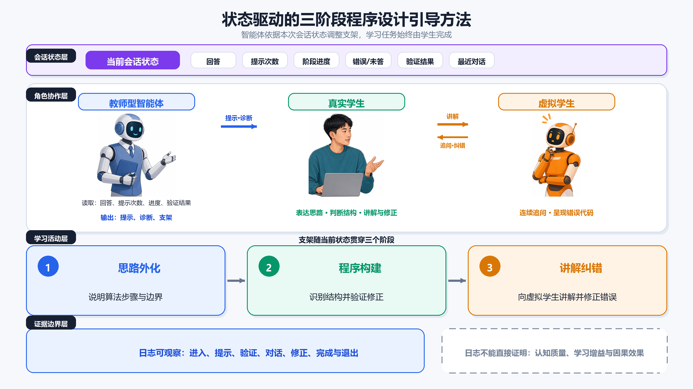

# 三阶段引导式学习在数据结构课程设计中的设计与应用

## 摘要

针对学生在程序设计作业中直接获取生成式AI答案、算法思路表达不足的问题，本文在数据结构课程设计平台中实现了三阶段引导式学习。学生先分题说明算法思路，再通过选择与填空完成代码重构，最后向虚拟学生讲解算法并修正其错误代码。该功能不是代码提交的必经步骤，学生可以直接编码；教师在课程群中鼓励体验，并以约占课程设计成绩10%的低门槛分数支持尝试。平台匿名数据包含117名学生、492次引导会话和9940条阶段日志。42名学生使用过该功能，其中37名重复使用，36名跨作业使用。相对稳定版本的398次会话中，224次完成全部阶段，89次没有形成第一阶段有效记录，74次停在第二阶段，11次进入第三阶段后未完成。结果表明，教师除关注完成率外，还应监测入口后的有效开始、第二阶段验证与回退、第三阶段对话和错误代码修正。首次提交前不同引导状态的提交结果存在自选择，固定效应分析未发现稳定的正向关联，现有数据不能判断学习增益。文章据此总结课程布置、平台监测、版本留痕和研究伦理方面的实施要点。

## 关键词

数据结构；程序设计教学；生成式人工智能；引导式学习；教学平台；学习过程

## 1 问题与设计目标

生成式AI可以解释算法、生成代码和定位错误，学生完成程序设计作业的方式随之改变。如果平台只增加一个自由问答框，学生最省力的用法往往是描述题目、索取代码、复制后再修改。教师能够看到最终提交，却未必知道学生是否分析过边界条件、理解代码结构或检查模型给出的错误。

程序设计教学已有几类可用的活动设计。自我解释要求学生说清步骤和依据，价值不在于“写过说明”，而在于说明是否包含概念联系[1-3]。Parsons Problems等代码重构任务为学生提供部分程序结构，减少从空白页开始的负担，但具体题型需要明确[4]。learning-by-teaching和可教智能体让学生承担讲解和纠错责任[5-7]。国内关于生成式AI作业设计和人机协同学习的研究也强调，学习者与机器如何分工，比是否使用工具更值得设计[8-9]。

据此，本项目设定了两个目标。第一，不让AI直接替学生走完“理解题目—形成算法—组织代码—检查错误”的全过程，而是把学生需要承担的活动放在界面中。第二，平台要留下可供教师复盘的过程记录，包括学生从哪里进入、停在哪一步、是否请求提示、是否经历验证失败，以及是否完成讲解和修正。本文报告的是一次真实课程实施，不是对教学效果的实验检验。

## 2 三阶段引导式学习的系统实现

学生在作业页面有两条路径：一条是直接编写并提交代码，另一条是进入引导式学习。进入后，三个阶段依次解锁；退出后仍可回到常规编码，不把引导完成设为提交前置条件。

第一阶段是思路外化。系统把算法描述拆成若干问题，要求学生说明处理步骤、关键条件或数据结构选择。教师型Agent在学生卡住时提供提示。平台记录回答提交、提示和阶段通过，不把学生回答正文纳入本次研究导出。

第二阶段是代码重构。稳定版使用逐步选择和填空，让学生依据前一阶段的思路识别代码结构。系统提供自动验证，学生需要处理错误后再继续。早期版本使用拖拽积木，课程运行中发现交互与显示问题后，改成了更易在网页端操作的测验形式。因此，本文将这一阶段称为“代码重构”，而不是笼统归为标准Parsons Problems。

第三阶段是讲解纠错。学生向虚拟学生讲解算法，虚拟学生连续追问，随后给出带有问题的代码。学生需要指出并修正错误。这里的学生Agent不是答案生成器，而是被讲解和被纠错的对象。平台记录对话轮次和修正事件，但本次分析不读取对话和代码正文。

图1 三阶段活动、智能体角色和平台记录

系统实现时应把“教学活动”和“可记录字段”一起设计。如果只有最终完成状态，教师看不到学生是没有真正开始、卡在验证，还是在对话后退出。本项目最终保留了会话、阶段、事件类型、时间、提示、验证、对话和修正等记录，并用匿名标识关联作业和提交。

## 3 课程组织与实施

项目应用于沈阳航空航天大学2024级网络工程1、2班的数据结构课程设计。平台共有117名学生、85项作业和1858次代码提交。教师在课程群中说明引导功能并鼓励学生尝试，但学生也可跳过引导直接写代码。

引导相关表现约占课程设计成绩的10%。实际评分采取低门槛方式，多数学生体验一次即可获得这一部分的8—9分，未体验可能为0分，但不会仅因这部分而不及格。设置分数的目的，是让学生愿意进入一个仍在更新的功能，而不是要求每道题都完成三阶段。论文和课程说明都应把这种安排说完整：学生有路径选择，但选择受到分数鼓励。

教师部署时可以按以下顺序组织。

1. 在作业开始前展示两条路径，说明不进入引导也能正常提交，避免学生把功能误解为强制步骤。
2. 说明三阶段分别要做什么、预计需要多少时间，以及系统不会直接代写最终答案。
3. 把低门槛激励规则提前公开，避免学生在课程后期才知道体验分。
4. 每周查看有效启动、阶段路径和系统异常，不等到课程结束只统计总使用量。
5. 系统更新时记录版本、上线时间、题型变化和受影响作业，重要改动尽量避开同一批学生正在进行的任务。

本次实施中，系统于2026年6月24日至28日连续调整：第一阶段由简述改为分题作答，第二阶段由拖拽积木改为选择与填空，并修复测验显示。线上平台通常在代码推送后很快更新，研究分析据Git时间建立版本边界。对于日常教学，这种记录也有用：若某几天验证失败或退出突然增多，教师可以先排查版本，而不是立即归因于学生能力。

## 4 使用情况与过程特征

### 4.1 采用不是一个比例

117名学生中有42名产生引导会话，共492次。250次会话最终完成，涉及34名学生。只有5名使用者恰好使用1次，37名至少使用2次，36名在多项作业中使用。26名学生产生不少于5次会话，18名不少于10次。最多的10名用户贡献57.70%的会话。

图2 全期采用、重复使用与使用集中度

这些数字对教师有两点提醒。其一，功能确实被一部分学生反复用于不同作业，不只是课程群通知后的集中点击。其二，492次会话主要来自重复用户，不能写成“492名学生参与”。平台仪表盘应同时显示学生数、会话数、重复用户和跨作业用户。

### 4.2 完成率要拆成路径

为避免题型变化混入路径比较，本文只分析相对稳定版本的398次会话。其中224次完成全部阶段，完成率为56.28%；89次没有形成第一阶段有效记录，74次停在第二阶段，11次进入第三阶段后未完成。

图3 稳定版398次会话的阶段路径

89次“无有效第一阶段记录”是实施中最先要查的部分。它可能来自误触入口、任务说明不清、学生快速退出或日志没有覆盖页面阅读。平台下一版应记录入口曝光、页面加载成功和主动退出原因，并在学生离开前用一句简短问题区分“暂时退出”“不想使用”和“系统异常”。

第二阶段是最明显的中止位置。74次会话停在此处；其中63次有可计算的阶段活跃时长，中位数4.45分钟，四分位距0.82—10.22分钟。较长停留可能是认真尝试，也可能是反复验证或离开页面。教师仪表盘应把时长与验证失败、再次作答放在一起看。

完成会话的第三阶段活跃时长中位数为5.86分钟，四分位距4.06—8.94分钟；对话轮数中位数为7轮，四分位距7—8轮；错误代码修正中位数为1次，四分位距1—2次。第三阶段因此不只是一个“完成”按钮，但这些操作数仍不能代表讲解正确。若教师要评价算法表达，应另设量规抽样查看去标识文本，而不是用对话轮数替代质量评分。

表1 适合教师日常查看的过程指标

| 环节 | 本次观察 | 教师需要追问的问题 |
|---|---|---|
| 入口与第一阶段 | 89/398次会话无有效第一阶段记录 | 是误触、说明不清、页面错误，还是学生选择退出？ |
| 第二阶段 | 74/398次停在第二阶段；63次可计时会话中位数4.45分钟 | 验证规则是否清楚，失败后是否给了针对性支架？ |
| 第三阶段 | 完成会话通常有7—8轮对话、1—2次修正 | 对话是否围绕算法依据，修正是否处理了真正错误？ |
| 全流程 | 224/398次全部完成 | 完成是否集中在少数学生或少数作业？ |

### 4.3 与代码提交的关系只能谨慎参考

首次提交关联分析包含994个学生—作业对。第一次提交前没有引导的有774对，开始但未完成引导的有37对，已完成引导的有183对。三组首次满分率分别为71.83%、59.46%和65.57%，首次沙箱通过率分别为75.70%、68.47%和69.95%；最终满分率分别为94.70%、94.59%和96.72%。

表2 首次提交前引导状态与提交结果

| 首次提交前状态 | 学生—作业对 | 学生 | 作业 | 首次满分率 | 首次通过率 | 最终满分率 | 平均提交次数 |
|---|---:|---:|---:|---:|---:|---:|---:|
| 无引导 | 774 | 66 | 57 | 71.83% | 75.70% | 94.70% | 1.491 |
| 引导未完成 | 37 | 20 | 22 | 59.46% | 68.47% | 94.59% | 1.838 |
| 引导完成 | 183 | 24 | 48 | 65.57% | 69.95% | 96.72% | 1.754 |

原始结果没有显示引导组首次提交更高。一个合理原因是，遇到困难的学生更可能主动求助。为减少稳定的学生差异和作业难度差异，分析加入学生固定效应和作业固定效应，标准误按学生聚类。完成引导相对无引导的首次满分系数为-0.027，95%置信区间[-0.206, 0.152]，p=0.767；未完成引导系数为-0.076，95%置信区间[-0.236, 0.083]，p=0.349。三水平模型只有32名学生在不同作业间改变引导状态，估计区间较宽。

这组分析的用途是阻止过度宣传：现有数据没有给出稳定的正向关联，也不能说明引导降低了成绩。固定效应控制不了“这道题当时是否卡住”、教师是否提醒和截止时间压力。没有对照实验、前后测和迁移题，就不能把会话数或最终通过率写成能力提升。

## 5 教学反思与改进建议

### 5.1 先把“有效开始”做好

课程第一次介绍功能时，教师应现场走一遍入口和第一道问题，让学生知道系统期待的是自己的算法说明，不是把题目粘贴给AI。入口页可显示三阶段概要和预计时长，同时保留“直接编码”和“稍后再学”。后台把“点击入口”与“提交第一道有效回答”分开统计，才能判断宣传触达和实际开始之间的损失。

### 5.2 第二阶段需要失败后的支架

选择与填空虽然比拖拽积木更适合网页操作，但自动验证若只返回“错误”，学生仍可能反复试选。建议按错误类型给出局部提示，例如指出控制结构、边界处理或变量更新所在区域，不直接显示正确选项。教师端按题目查看验证失败分布；若同一空缺集中失败，应先检查题目表达和判定规则。

### 5.3 第三阶段保留“讲”和“改”两个动作

第三阶段不应退化成自由聊天。虚拟学生的追问需要覆盖算法步骤、条件、复杂度和边界情况；随后提供的错误代码要与前面对话相关。系统记录“解释了什么—被追问什么—修改了什么”的链条。正式研究若要判断质量，可用盲评量规抽样编码；日常课堂则可让教师查看去标识摘要，而不是逐条阅读全部对话。

### 5.4 激励规则要透明，研究同意要独立

低门槛分数能鼓励首次尝试，但不能把体验分和研究同意绑在一起。学生应当知道：是否同意数据用于研究，不影响功能使用和课程得分。下一轮研究需在采集前完成伦理审查或书面豁免，明确数据字段、保存期限、访问人员和退出方式。匿名化只能降低隐私风险，不能替代伦理程序[10-11]。

### 5.5 版本进入日志，不只留在Git

本次研究通过Git提交近似恢复线上版本，仍有部署延迟和配置差异。下一版应在会话创建时写入前端版本、后端版本、题型配置和模型配置标识。系统异常也要成为事件。这样教师看到某天大量会话停在第二阶段时，能够区分教学难点与软件问题。

### 5.6 下一轮用课程可接受的比较设计

若要检验效果，可按班级或作业单元采用阶梯楔形开放：不同单元按随机顺序启用三阶段，研究末期全部获得功能，减少同班学生界面不同和相互转述造成的串扰。测量至少包含前测、后测、延迟迁移题和算法解释盲评。主要结果应是解释质量与迁移表现，首次提交和阶段日志作为次要结果。分析计划、排除规则和缺失处理在看结果前注册。

## 6 结语

本项目把生成式AI从“给学生答案”改造成三类具体活动：要求学生先说明，再识别代码结构，最后面对一个会追问和犯错的虚拟学生完成讲解与修正。真实课堂数据表明，一部分学生会跨作业重复使用，也显示出入口无有效开始和第二阶段中止等实施问题。

对教师而言，最可复用的经验不是某个完成率，而是把活动、记录和改进连在一起：学生被要求做什么，平台能观察到什么，教师根据什么调整。当前数据适合支持这一层面的教学复盘，不适合证明学习增益。效果问题需要下一轮有计划的比较设计来回答。

## 参考文献

[1] CHI M T H, BASSOK M, LEWIS M W, et al. Self-explanations: How students study and use examples in learning to solve problems[J]. Cognitive Science, 1989, 13(2): 145-182.

[2] RENKL A. Learning from worked-out examples: A study on individual differences[J]. Learning and Instruction, 1997, 7(1): 1-15.

[3] HEFTER M H, KUBIK V, BERTHOLD K. Can prompts improve self-explaining an online video lecture? Yes, but do not disturb![J]. International Journal of Educational Technology in Higher Education, 2023, 20: 15.

[4] ERICSON B J, et al. Parsons Problems and Beyond: Systematic Literature Review and Empirical Study Designs[C]//Proceedings of the 2022 Working Group Reports on Innovation and Technology in Computer Science Education. New York: ACM, 2022: 191-234.

[5] FIORELLA L, MAYER R E. The relative benefits of learning by teaching and teaching expectancy[J]. Contemporary Educational Psychology, 2013, 38(4): 281-288.

[6] CHASE C C, CHIN D B, OPPEZZO M A, et al. Teachable agents and the protégé effect: Increasing the effort towards learning[J]. Journal of Science Education and Technology, 2009, 18: 334-352.

[7] JAEGER A J, et al. The interrelationship between concepts about agency and students’ use of teachable-agent learning technology[J]. Cognitive Research: Principles and Implications, 2019, 4: 47.

[8] 李海峰, 王炜. 生成式人工智能时代的学生作业设计与评价[J]. 开放教育研究, 2023, 29(3): 31-39.

[9] 王一岩, 刘淇, 郑永和. 人机协同学习：实践逻辑与典型模式[J]. 开放教育研究, 2024, 30(1): 65-72.

[10] 王佑镁, 王欣颖, 柳晨晨. 教育领域生成式人工智能应用的伦理风险管理框架研究[J]. 电化教育研究, 2024, 45(10): 28-35.

[11] 王佑镁, 王旦, 王海洁, 等. 基于风险性监管的AIGC教育应用伦理风险治理研究[J]. 中国电化教育, 2023(11): 83-90.

[12] 孙丹, 朱城聪, 许作栋, 等. 基于生成式人工智能的大学生编程学习行为分析研究[J]. 电化教育研究, 2024, 45(3): 113-120.

[13] UTAMACHANT P, ANUTARIYA C, PONGNUMKUL S. i-Ntervene: Applying an evidence-based learning analytics intervention to support computer programming instruction[J]. Smart Learning Environments, 2023, 10: 37.

[14] BECKER B A, et al. Programming Is Hard—or at Least It Used to Be: Educational Opportunities and Challenges of AI Code Generation[C]//Proceedings of the 54th ACM Technical Symposium on Computer Science Education V. 1. New York: ACM, 2023: 500-506.

[15] KASNECI E, et al. ChatGPT for good? On opportunities and challenges of large language models for education[J]. Learning and Individual Differences, 2023, 103: 102274.
