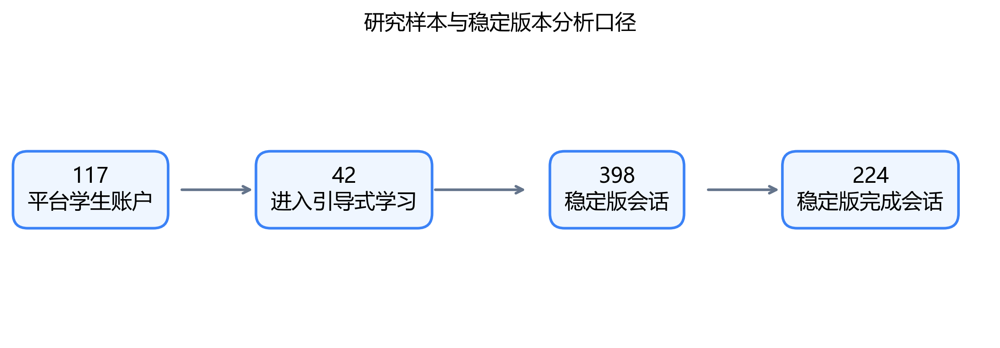
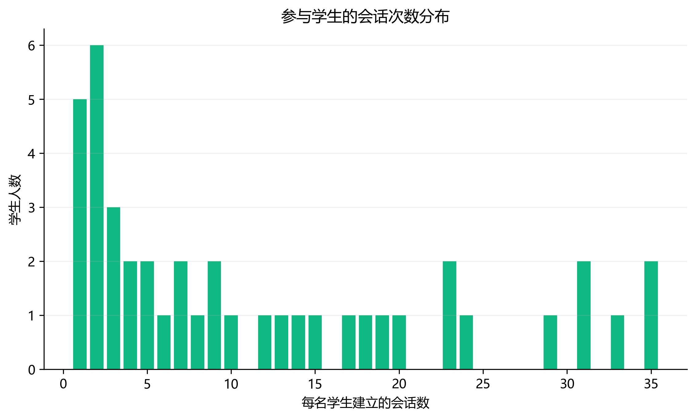
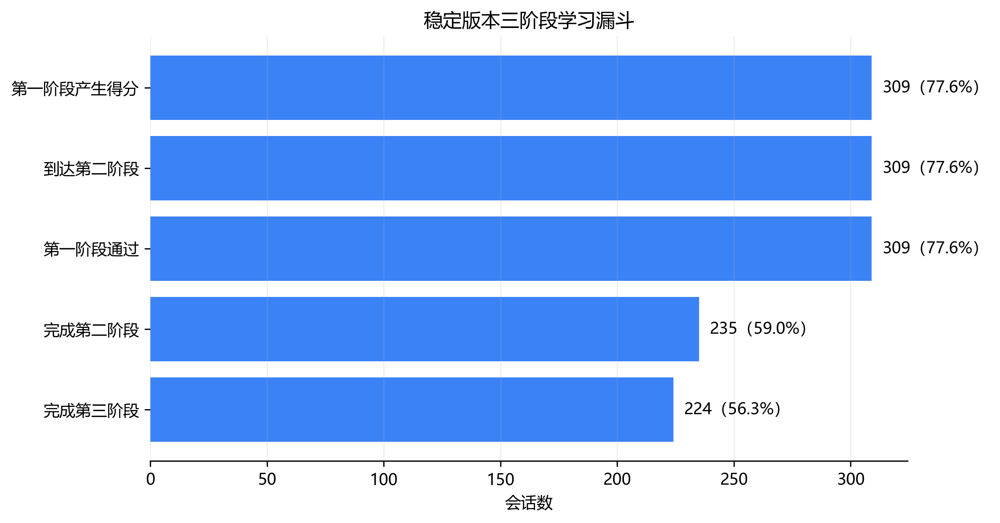
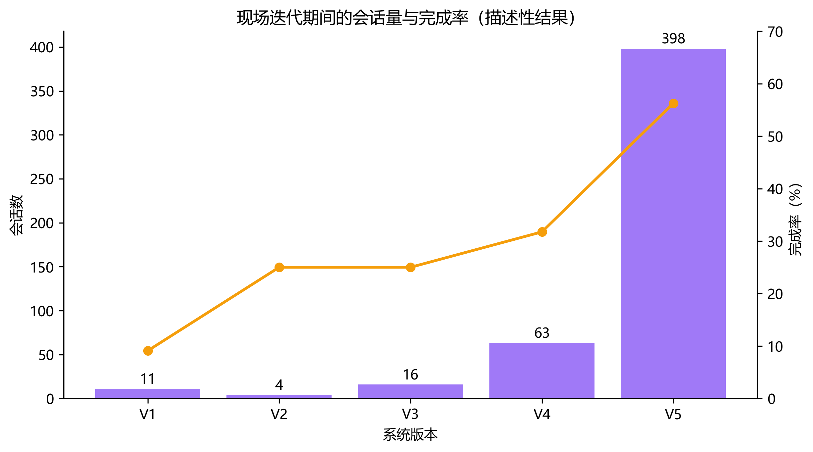

# 面向程序设计学习的三阶段引导式学习设计与课堂应用：基于真实在线平台的学习行为分析

## 摘要

## 关键词

程序设计教育；引导式学习；生成式人工智能；learning-by-teaching；学习分析

## 1 引言

## 2 相关研究

### 2.1 思路外化与程序设计学习脚手架

### 2.2 Parsons Problems与代码重构

### 2.3 Learning-by-teaching与可教智能体

### 2.4 生成式人工智能支持的程序设计学习

## 3 三阶段引导式学习设计

### 3.1 设计目标与总体流程

CodeSense是一个面向程序设计课程的在线学习平台，提供作业发布、代码提交、自动评测和学习过程记录等功能。学生在作业页面可以直接进入代码编辑器，也可以选择“三阶段引导式学习”入口。引导流程不替代代码提交，而是安排在正式编程之前或编程过程中，帮助学生依次完成思路表达、程序结构重构和角色反转教学。

三阶段流程的设计目标不是让生成式AI直接给出答案，而是把原本容易被压缩成“写出正确代码”的任务拆开。第一阶段要求学生用自然语言说明算法；第二阶段把这些说明映射到程序结构；第三阶段让学生向虚拟同学讲解，并检查虚拟同学生成的错误代码。学生需要在三个阶段持续产出内容，AI主要承担提问、反馈和角色模拟。

系统为每道作业生成学习预设，包括关键步骤、算法简述、代码结构材料、干扰项、逐步问题和第三阶段角色参数。一次引导式学习对应一个会话。会话记录当前阶段、阶段得分、提示次数、对话轮次和完成状态；阶段日志记录描述提交、提示请求、对话、验证失败、阶段通过、虚拟学生写代码和学生修复代码等事件。

### 3.2 第一阶段：思路外化

第一阶段要求学生在动手编码前说明题目的输入、关键处理步骤、边界条件和输出。系统根据作业预设展示算法简述和引导问题，学生逐题填写自己的理解。提交后，AI结合关键步骤评估回答并给出反馈；学生可以修改回答，也可以请求提示。

线上后台以50分作为第一阶段通过条件。达到条件后，会话进入第二阶段。部署早期，第一阶段使用单个文本框，初始通过线为80分。2026年6月24日，系统加入算法简述和引导问题，并将后台通过线降至50分；6月25日又改为按问题分别作答，同时限制直接粘贴。前端提示文字曾短暂显示60分，但后台判定始终按50分执行。本文的数据处理以后台状态和阶段日志为准。

限制粘贴并不能证明回答一定由学生独立产生。它只是提高整段复制的操作成本。因此，本文把第一阶段数据解释为学生在平台中完成的思路表达行为，不把文本长度或阶段得分直接等同于算法理解水平。

### 3.3 第二阶段：代码重构

第二阶段帮助学生把自然语言思路转成程序结构。该阶段在课堂部署期间出现过两种形式。

2026年6月26日以前，系统提供打乱的代码块和干扰块。学生需要选择正确代码块、恢复顺序、调整缩进，并通过即时预览检查拼装结果。这一形式接近Parsons Problems：它避免学生从空白页面开始写完整程序，同时保留程序结构判断和干扰项辨别任务。

6月26日起，第二阶段改为逐步选择和填空。系统按照程序执行逻辑展示若干步骤，学生为每一步选择代码片段或填写缺失表达式，右侧同步生成代码预览。改版后不再要求拖拽完整代码块，也不符合严格意义上的Parsons Problems。本文将两个版本统称为“代码重构阶段”，只在讨论早期版本时使用“Parsons型代码块重构”。

学生提交第二阶段答案后，后台逐项核对预设答案。全部通过后，会话进入第三阶段；未通过时记录验证失败，学生可以继续修改或请求提示。

### 3.4 第三阶段：角色反转教学与错误代码修正

第三阶段包含教师智能体和虚拟学生两个角色。学生可以先向教师智能体提问，澄清仍不理解的知识点。随后，系统切换到基础较弱的虚拟学生“小明”，由真实学生向其讲解解题过程。虚拟学生按照预设角色提出疑问，例如混淆循环条件、质疑算法选择或追问边界情况。

达到预设对话轮次后，虚拟学生根据题目、关键步骤和学生讲解生成一份带有典型错误的代码，并请求学生帮助。学生需要在编辑区修改代码并提交。系统评估修正结果；通过后将第三阶段和整个会话标记为完成。

这一步把“教会别人”和“检查错误”连接起来。学生的任务不是接受AI答案，而是解释、判断和修正AI产物。系统更新没有改变第三阶段的基本顺序，但逐步增加了历史对话恢复、重复回答拦截、题目上下文和学生当前状态注入，使角色对话能够延续先前学习状态。

### 3.5 AI陪伴与状态记录

第一、二阶段提供陪伴式对话。系统向AI传入当前阶段、学生已填写的回答、第二阶段当前答案和必要的作业上下文，使回复与学生正在进行的操作相联系。页面刷新后，系统根据数据库中的会话和阶段日志恢复进度，减少因中断造成的重复操作。

本文不评价模型生成文本本身的准确率，因为匿名导出没有包含对话正文和学生代码。可分析信息限于事件类型、发生时间、角色、内容长度、提示次数、对话轮次和阶段状态。相应地，研究关注学生是否使用、如何推进和在哪里退出，而不对具体对话质量作超出数据范围的判断。

### 3.6 现场迭代与版本边界

三阶段完整框架于2026年5月12日进入代码库。正式课堂数据从6月18日开始产生。系统在使用期间继续调整：6月24日至25日主要修改第一阶段脚手架和积木工作区；6月26日将第二阶段改为选择与填空；6月28日完成测验版显示和并发相关修正，此后交互形式相对稳定。

在线平台通常在代码推送至GitHub `main` 分支后立即更新。本文把Git提交时间作为近似版本边界，并将北京时间换算为UTC后与平台日志对齐。部署仍可能存在分钟级延迟，因此边界附近的会话在敏感性分析中单独标记。

## 4 研究方法

### 4.1 研究设计

本研究采用设计型研究与回顾性学习分析相结合的方式。设计型研究部分描述三阶段流程在真实课程中的实现和迭代；学习分析部分使用平台在正常教学中产生的匿名日志，考察学生采用、重复使用、阶段推进和代码提交表现。

研究没有随机分组、前测或同期对照组。学生是否进入引导式学习由自己决定，系统版本也随课堂使用持续更新。因此，本文不估计三阶段学习的因果效果。版本间结果用于描述现场迭代期间的行为轨迹，代码提交模型用于探索条件关联。

研究问题如下：

- RQ1：学生如何进入和持续使用三阶段引导式学习？
- RQ2：学生在三个学习阶段中的推进、停留和退出呈现什么特征？
- RQ3：平台迭代前后，学生的参与和完成轨迹有何描述性差异？
- RQ4：引导式学习参与程度与后续代码提交表现存在怎样的探索性关联？

### 4.2 教学场景与参与方式

研究发生在沈阳航空航天大学2024级网络工程专业1、2班的数据结构课程设计中。平台中共有117个学生账户。学生可以直接编写和提交代码，也可以自行进入三阶段引导式学习。教师在班级群中鼓励学生尝试使用系统，用于锻炼算法思维，也为系统现场运行积累使用记录。

引导式学习参与与课程设计过程分有关。课程设计总评中有10分用于学习过程参与，但执行方式较宽松：学生尝试使用即可获得大部分分数，多数学生最终得到8—9分；完全没有参与的学生可能得到0分，但不会仅因该项成绩不及格。系统当时也处于边使用边调整的阶段，教师没有要求学生在每道题上完成三阶段流程。

因此，本文将参与方式界定为“学生自主选择进入，但受到低门槛课程过程分鼓励”。它既不是无成绩影响的完全自愿使用，也不是所有学生必须完成的强制活动。

### 4.3 数据来源与隐私处理

数据由只读脚本从线上MySQL数据库导出。导出包包含用户、作业、代码提交、引导式学习会话、阶段日志和作业预设六类研究表，以及字段清单和数据质量报告。导出脚本没有修改业务数据。

用户、作业、提交和会话标识经过同一数据包内稳定的HMAC匿名化。导出内容不包括姓名、原始学号、邮箱、密码、班级名称、作业标题、题目正文、完整代码、对话正文、AI反馈正文、标准答案或数据库连接信息。本文使用的导出包不含自由文本。

数据快照包括123个用户账户，其中117个为学生账户；另有85项作业、1858次代码提交、492次引导式学习会话、9940条阶段日志和85条作业预设。数据质量检查没有发现缺表、缺字段或孤立外键记录。引导式学习会话发生在2026年6月18日至7月8日，阶段日志覆盖至7月8日。

### 4.4 分析样本

分析使用三个相互补充的口径。

第一，全量部署样本包含全部492次会话，用于回答RQ1，并描述整个观察期的采用、重复使用和跨作业使用。共有42名学生至少建立过一次引导式学习会话，其中34名至少完成过一次。

第二，稳定版本主样本包含2026年6月28日00:26（北京时间）以后建立的398次会话，涉及40名学生和54项作业，其中224次完成。RQ2的主要阶段漏斗和行为描述优先使用该样本，同时报告全量结果作为参照。

第三，版本样本按照会话建立时间分为五组。V1至V3共31次会话，用于描述早期试用和积木版调整；V4包含63次测验过渡版会话；V5即398次稳定版会话。阶段事件还按照自身发生时间重新归类，以识别跨版本会话。

代码提交关联分析限于2026年6月18日以后发生的提交，形成994个“学生—作业”对。该时间限制避免把引导式学习上线前的大量历史提交混入暴露比较。

### 4.5 指标定义

RQ1使用学生数、会话数、完成会话数、每名学生会话数、跨作业使用和使用集中度。重复使用者定义为建立至少两次会话的学生；跨作业使用者定义为在至少两项作业上建立会话的学生。

RQ2根据会话字段和阶段日志重建流程。主要节点包括第一阶段产生得分、到达第二阶段、完成第二阶段和完成第三阶段。阶段通过事件按“会话—阶段”去重，避免同一会话的重复日志被累计为多个通过者。

平台记录的总时长可能包含页面闲置。本文另行计算事件截断活跃时长：按照时间排序同一会话的事件，累加相邻事件间隔，每个间隔最多计300秒。该指标用于区分连续交互和长时间离开页面，不视为精确在屏时间。

RQ3使用Git提交对应的五个版本边界，报告各版本会话数、涉及学生、涉及作业、完成数和完成率。由于不同版本的学生和作业重复出现，早期样本也较小，版本完成率不进行因果比较。

RQ4的暴露变量为学生是否在某项作业的首次代码提交前进入过引导式学习。结果变量包括该作业最后一次提交是否完全通过、最后一次提交的沙箱测试通过率，以及观察期内提交尝试次数。

### 4.6 统计分析

RQ1至RQ3以描述统计为主。计数变量报告人数或会话数，比例同时给出分母；偏态的行为时长使用中位数。会话版本按照 `started_at` 归类，事件版本按照日志时间归类。跨版本边界的会话在保留和排除两种口径下核验。

RQ4先报告原始组间比例，再使用线性固定效应模型：

```text
outcome = guided_before_first + student fixed effects
          + assignment fixed effects + error
```

学生固定效应用于控制不随作业变化的学生差异，作业固定效应用于控制同一道题的共同难度。标准误按学生聚类。三个结果分别建模，不把模型系数解释为处理效应。所有模型报告系数、聚类标准误、p值和95%置信区间。

分析脚本直接读取匿名ZIP并生成聚合CSV与JSON。正文数字以冻结输出为准。分析脚本和测试保存在项目仓库中，原始或匿名课程数据不公开提交。

### 4.7 伦理说明

数据来自正常教学活动，研究分析在课程活动结束后进行。分析不会追溯改变学生成绩，论文也不报告个人轨迹或可识别案例。

参与与课程过程分存在联系，且数据最初并非为随机实验收集。正式投稿前，研究团队需向学校负责伦理审查的机构确认是否需要补充审查或取得豁免，并按照目标期刊要求说明数据使用依据、隐私措施和学生权益。取得相应文件之前，本文只作为内部研究稿，不提交对伦理证明有明确要求的期刊。

## 5 研究结果

### 5.1 学生采用与重复使用

117个学生账户中，42名学生进入过引导式学习，占35.9%。这42名学生共建立492次会话，其中34人至少完成过一次，共完成250次。图1给出了全体学生账户、实际采用者和稳定版本会话的样本关系。



采用并不只表现为一次性尝试。仅5名学生只建立过1次会话，37名学生至少使用2次，重复使用者贡献了487次会话，占全部会话的99.0%。36名学生在至少两项作业中使用过该功能；26人建立过不少于5次会话，18人建立过不少于10次。会话分布呈右偏，单人最多建立35次会话（图2）。使用量也较为集中，使用次数最多的10名学生贡献了57.7%的会话。



这些结果回答了RQ1：三阶段入口只覆盖了约三分之一的学生，但进入者中绝大多数后来再次使用，并且通常跨越多项作业。这里的“重复使用”只能说明学生再次选择了该流程，不能单独证明学习收益，也不能排除过程分鼓励、作业难度和个人使用习惯的影响。

### 5.2 三阶段推进与退出

全量492次会话中，382次留下第一阶段得分，376次到达并通过第一阶段，270次完成第二阶段，250次完成第三阶段。按全部已建立会话计算，完整完成率为50.8%。由于早期版本处于连续调整中，以下以V5稳定版本的398次会话作为RQ2的主要分析样本。

稳定版本中，309次会话产生第一阶段得分并到达第二阶段，占已建立会话的77.6%；235次完成第二阶段，占59.0%；224次完成第三阶段，占56.3%（图3）。从已到达第二阶段的309次会话看，74次没有完成该阶段，即24.0%；而在完成第二阶段的235次会话中，224次继续完成第三阶段，条件完成率为95.3%。因此，日志中最明显的流失发生在会话建立至第一阶段形成有效得分之前，以及代码重构阶段，而不是进入角色反转教学之后。



以相邻事件间隔最多计入300秒估算活跃时长时，250次有事件记录的已完成会话中位数为12.54分钟，134次有事件记录的未完成会话中位数为7.22分钟。该指标用于减少页面长时间闲置带来的偏差，不等同于精确的屏幕学习时长。综合来看，三阶段流程能够在真实课设环境中被完整走通，但“建立会话”并不等于开始了可分析的第一阶段活动，第二阶段仍是后续优化的主要位置。

### 5.3 版本迭代期间的使用轨迹

五个版本分别记录11、4、16、63和398次会话，对应完成率为9.1%、25.0%、25.0%、31.8%和56.3%（表1、图4）。V1至V3合计只有31次会话，V4也处于第二阶段交互改版和并发问题修复期间；V5则覆盖40名学生、54项作业和398次会话，构成了绝大多数现场记录。

| 版本 | 主要形态 | 会话数 | 学生数 | 作业数 | 完成数 | 完成率 |
| --- | --- | ---: | ---: | ---: | ---: | ---: |
| V1 | 初始线上版 | 11 | 4 | 7 | 1 | 9.1% |
| V2 | 第一阶段脚手架版 | 4 | 3 | 4 | 1 | 25.0% |
| V3 | 分题作答与增强积木版 | 16 | 6 | 13 | 4 | 25.0% |
| V4 | 第二阶段测验过渡版 | 63 | 12 | 34 | 20 | 31.8% |
| V5 | 相对稳定测验版 | 398 | 40 | 54 | 224 | 56.3% |



完成率随版本推进而上升，但这条轨迹不能解释为改版带来的因果提升。版本并非随机分配，学生和作业在不同版本间重复出现，早期样本很小，教师鼓励和课程进度也在同期变化。此外，分别有4、5、4和13次会话跨越V2至V5的事件时间边界。因而，图4只用于呈现系统从早期试用走向稳定使用的现场过程，回答RQ3的描述性问题，不承担版本效果检验。

### 5.4 与代码提交表现的探索性关联

2026年6月18日之后形成994个“学生—作业”对，其中220个在第一次代码提交前已有引导式学习记录，774个没有。原始结果中，两组最后一次提交的完全通过率分别为96.36%和94.70%，最终沙箱通过率分别为97.95%和96.82%，平均提交次数分别为1.768次和1.491次。两组的最终成绩都接近满值，显示出明显的结果天花板。

加入学生固定效应和作业固定效应，并按学生聚类标准误后，“首次提交前使用引导式学习”与最终完全通过的系数为−0.0188（SE=0.0218，p=0.390，95% CI [−0.0616, 0.0240]），与最终沙箱通过率的系数为−0.0042（SE=0.0118，p=0.718，95% CI [−0.0273, 0.0188]），与提交次数的系数为0.1032（SE=0.1549，p=0.505，95% CI [−0.2004, 0.4068]）。三个置信区间均跨越零。

因此，RQ4的结果是：在当前观察数据和指标下，没有发现稳定、可与零区分的条件关联。原始比例的轻微差异在控制学生和作业差异后没有保留为明确证据。由于学生自主选择是否进入引导流程、参与又受到课程过程分鼓励，加之最终提交表现存在天花板，这一分析既不能证明三阶段学习有效，也不能据此认定它无效。它更直接地说明，若要检验学习效果，后续研究需要前测或基线能力、过程性理解指标，以及预先设计的对照条件。
## 6 讨论

### 6.1 三阶段流程的可实施性

### 6.2 重复使用与单次完成的不同含义

### 6.3 现场迭代对证据解释的影响

### 6.4 成绩激励、自主选择与结果天花板

### 6.5 对程序设计学习平台设计的启示

## 7 局限与结论

## 参考文献
