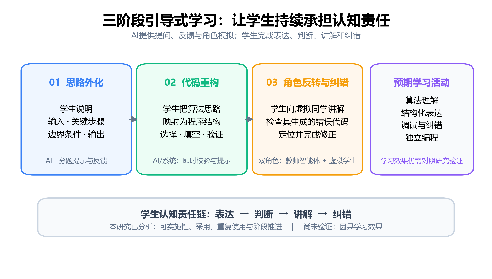

# 程序设计学习中的三阶段引导式学习：设计、课堂应用与行为分析

## 摘要

生成式人工智能进入程序设计课堂后，一个直接问题是如何让学生继续承担解释、结构化和纠错等认知活动，而不是只获取可运行代码。本文设计并部署了一种三阶段引导式学习流程：学生先用自然语言外化解题思路，再完成代码重构，最后向虚拟学生讲解算法并修正其生成的错误代码。研究采用设计型研究与回顾性学习分析相结合的方法，分析某高校两个网络工程班数据结构课设期间产生的匿名平台记录。117个学生账户中，42名学生进入过引导式学习，共建立492次会话；37名采用者重复使用，36名跨作业使用。相对稳定版本包含398次会话，其中224次完成全部阶段，完整完成率为56.3%；主要流失发生在形成第一阶段有效活动之前和第二阶段。固定效应模型未发现首次代码提交前使用引导式学习与最终完全通过、最终沙箱通过率或提交次数之间存在可与零区分的关联。这一流程能够嵌入真实课设并形成持续使用，但现有观察数据不足以证明学习效果。本文给出三阶段活动的实现设计和现场迭代的版本化分析方法，并说明缺少对照实验时这些证据能够回答什么、不能回答什么。

## 关键词

程序设计教育；引导式学习；生成式人工智能；learning-by-teaching；学习分析

## 1 引言

生成式人工智能可以解释程序、补全代码和定位错误，也使程序设计教学面临新的责任分配问题。如果系统直接把答案交给学生，原本应由学习者完成的算法分析、结构组织和调试可能被压缩成提示词输入与结果复制。真正值得研究的并不只是“是否允许学生使用AI”，而是平台如何安排交互，使学生在使用AI时仍需表达思路、作出结构判断并检查生成结果。

已有程序设计学习活动提供了几个可组合的方向。自我解释提示促使学习者说明步骤和理由；Parsons Problems等代码重构任务降低从空白页面开始编程的负担，同时保留结构判断；learning-by-teaching则通过“学生成为讲解者”的角色反转，要求学习者组织知识并监控被教对象的理解。生成式AI能够承担反馈者、教师或虚拟学生等角色，但角色本身不会自动带来学习。学生是否需要作出判断、解释依据和修正错误，仍取决于具体任务设计。

现有研究多分别考察上述活动，或者把大语言模型作为答疑者、结对伙伴和可教对象。较少有研究把思路外化、代码重构、向虚拟学生讲解以及错误代码修正组织成一条连续的课前编程流程，并在真实课程平台中记录学生从一个阶段到下一个阶段的行为。真实部署还会带来实验室研究中不易出现的问题：功能边使用边调整，教师鼓励与课程成绩共同影响采用，学生可以绕过引导流程直接提交代码，版本与课程进度也同步变化。

基于这些问题，本文在CodeSense在线程序设计平台中设计了三阶段引导式学习。第一阶段要求学生说明算法；第二阶段要求学生把说明映射为代码结构；第三阶段由学生教授一名基础较弱的虚拟同学，并修正其生成的典型错误代码。本文不把三阶段中的任一机制表述为首创，关注的是它们如何被连续编排，以及这一组合在真实数据结构课设中如何被采用、推进和重复使用。

本文分析沈阳航空航天大学2024级网络工程1、2班的匿名平台日志。研究没有随机分组、前测或同期对照，参与还受到低门槛课程过程分的鼓励。因此，本文采用设计型研究与回顾性学习分析，回答采用、阶段漏斗、版本轨迹和代码提交关联四类问题，而不估计因果效果。本文的贡献包括：

- 提出一条从思路表达、代码重构到角色反转教学与错误修正的三阶段流程，并说明其状态、事件和版本实现；
- 利用真实课堂日志描述采用、重复使用和阶段退出，展示该流程在课设环境中的可实施性与主要摩擦点；
- 将Git提交边界与平台事件对齐，区分早期迭代和稳定版本，避免把现场改版误当作受控实验；
- 在缺少对比实验的条件下报告固定效应关联分析，同时明确成绩激励、自主选择和结果天花板对结论的限制。

## 2 相关研究

### 2.1 思路外化与程序设计学习脚手架

自我解释要求学习者对材料中的步骤、概念联系或推理依据作出说明，而不只是复述已有信息。Bichler等（2022）的研究表明，自我解释的质量与是否包含理由和概念应用有关。Hefter等（2023）进一步显示，不同提示会改变在线学习中的自我解释过程，提示造成的中断与学习者是否持续作答也值得记录。这意味着，在程序设计任务中加入文本框并不必然形成有价值的解释；问题需要被拆分，提示需要指向输入、关键步骤、边界条件和输出等具体对象。

编程脚手架的影响也未必直接体现在最终成绩上。Ouyang等（2022）发现，学习者对教师脚手架的吸收可能表现为延迟行为；Zhang等（2026）使用多模态学习分析考察动态编程脚手架，也说明过程参与和结果指标可能呈现不同模式。基于这一认识，本文第一阶段既保存得分与通过状态，也记录提交、提示和阶段推进事件。研究重点不是把文本长度等同于理解，而是观察学生是否形成可分析的思路表达并继续后续活动。

### 2.2 Parsons Problems与代码重构

Parsons Problems通常向学习者提供被打乱的代码块，要求其恢复正确顺序或缩进。Ericson等（2022）的综述指出，这类任务能够减少从空白页生成完整代码的负担，但代码块、干扰项、缩进方式和反馈形式的差异会改变任务性质。研究者因而需要清楚披露题型变体，不能把所有“选择代码”的活动视为同一种干预。

CodeSense第二阶段的早期版本使用带干扰项的代码块排序，接近Parsons Problems；稳定版本则改为逐步选择和填空，并同步生成代码预览。后者仍要求学生判断程序结构，却不再符合严格意义上的Parsons Problems。本文因此使用范围更宽的“代码重构”来指称第二阶段，只在讨论早期实现时使用“Parsons型代码块重构”。这一术语区分也构成版本分析的必要前提。

### 2.3 Learning-by-teaching与可教智能体

learning-by-teaching把学习者置于讲解者位置，使其组织知识、预测对方困难并检查讲解是否充分。可教智能体把这种活动具体化为“学生教授一个知识较弱的对象”。Jaeger等（2019）对Betty's Brain的研究提示，学生如何理解智能体的能动性会影响其使用方式和学习结果；可教对象并不是一个对所有学生都透明且含义相同的工具。

大语言模型使虚拟学生能够进行开放对话。Yang、Pujara和Li（2025）让本科生向带有预设知识缺口的大语言模型讲授计算机知识，是与本文第三阶段最接近的研究。本文的不同之处不在于首次让学生教授AI，而在于把该活动放在思路外化和代码重构之后，并增加“虚拟学生生成错误代码—真实学生检查并修正”的闭环。根据Kuhail等（2023）对教育聊天机器人的综述，可教角色相较教学角色仍不常见，但角色标签本身不足以说明认知活动，仍需交代学生实际承担什么任务。

### 2.4 生成式人工智能支持的程序设计学习

程序设计教育中的生成式AI既可作为解释者，也可作为结对伙伴、反馈工具或代码生成器。Dickey、Bejarano和Garg（2023）提出的AI-Lab框架把检查边界条件和修正生成错误作为学生责任；Lyu等（2025）的课堂比较则表明，人类结对、人与AI结对和单人与AI编程会产生不同的成绩与体验。两项研究共同说明，“使用AI”不是边界清楚的单一干预，协作角色和认知责任必须被具体定义。

近期综述也反复指出，生成式AI在程序设计教育中常被用于支持性反馈，同时伴随过度依赖、错误信息和实施条件不清等风险（Elnaffar et al., 2025；Nathaniel et al., 2025）。因此，本文的设计原则不是减少一切AI输出，而是让学生对关键产物负有可观察的责任：先提交自己的解释，再作出代码结构选择，最后评价并修正AI生成的错误代码。

在真实课堂中，平台日志可以补充最终分数。i-Ntervene等系统表明，在线评测与学习分析能够支持持续教学干预，但并非每次干预都会带来预期变化（Utamachant et al., 2023）。在线编程行为也可用于描述进展，不过关联或预测结果不等于因果效果（Zhang et al., 2025）。据此，本文把采用和阶段过程作为主要证据，把代码成绩关联放在探索性位置。

## 3 三阶段引导式学习设计

### 3.1 设计目标与总体流程

CodeSense是一个面向程序设计课程的在线学习平台，提供作业发布、代码提交、自动评测和学习过程记录等功能。学生在作业页面可以直接进入代码编辑器，也可以选择“三阶段引导式学习”入口。引导流程不替代代码提交，而是安排在正式编程之前或编程过程中，帮助学生依次完成思路表达、程序结构重构和角色反转教学。

三阶段流程的设计目标不是让生成式AI直接给出答案，而是把原本容易被压缩成“写出正确代码”的任务拆开。第一阶段要求学生用自然语言说明算法；第二阶段把这些说明映射到程序结构；第三阶段让学生向虚拟同学讲解，并检查虚拟同学生成的错误代码。学生需要在三个阶段持续产出内容，AI主要承担提问、反馈和角色模拟。

图1概括了三阶段之间的认知责任转移。图中右侧的算法理解、结构化表达、调试与独立编程是设计所指向的学习活动，不是本文已经验证的效果。



系统为每道作业生成学习预设，包括关键步骤、算法简述、代码结构材料、干扰项、逐步问题和第三阶段角色参数。一次引导式学习对应一个会话。会话记录当前阶段、阶段得分、提示次数、对话轮次和完成状态；阶段日志记录描述提交、提示请求、对话、验证失败、阶段通过、虚拟学生写代码和学生修复代码等事件。

### 3.2 第一阶段：思路外化

第一阶段要求学生在动手编码前说明题目的输入、关键处理步骤、边界条件和输出。系统根据作业预设展示算法简述和引导问题，学生逐题填写自己的理解。提交后，AI结合关键步骤评估回答并给出反馈；学生可以修改回答，也可以请求提示。

线上后台以50分作为第一阶段通过条件。达到条件后，会话进入第二阶段。部署早期，第一阶段使用单个文本框，初始通过线为80分。2026年6月24日，系统加入算法简述和引导问题，并将后台通过线降至50分；6月25日又改为按问题分别作答，同时限制直接粘贴。前端提示文字曾短暂显示60分，但后台判定始终按50分执行。本文的数据处理以后台状态和阶段日志为准。

限制粘贴并不能证明回答一定由学生独立产生。它只是提高整段复制的操作成本。因此，本文把第一阶段数据解释为学生在平台中完成的思路表达行为，不把文本长度或阶段得分直接等同于算法理解水平。

### 3.3 第二阶段：代码重构

第二阶段帮助学生把自然语言思路转成程序结构。该阶段在课堂部署期间出现过两种形式。

2026年6月26日以前，系统提供打乱的代码块和干扰块。学生需要选择正确代码块、恢复顺序、调整缩进，并通过即时预览检查拼装结果。这一形式接近Parsons Problems：它避免学生从空白页面开始写完整程序，同时保留程序结构判断和干扰项辨别任务。

6月26日起，第二阶段改为逐步选择和填空。系统按照程序执行逻辑展示若干步骤，学生为每一步选择代码片段或填写缺失表达式，右侧同步生成代码预览。改版后不再要求拖拽完整代码块，也不符合严格意义上的Parsons Problems。本文将两个版本统称为“代码重构阶段”，只在讨论早期版本时使用“Parsons型代码块重构”。

学生提交第二阶段答案后，后台逐项核对预设答案。全部通过后，会话进入第三阶段；未通过时记录验证失败，学生可以继续修改或请求提示。

### 3.4 第三阶段：角色反转教学与错误代码修正

第三阶段包含教师智能体和虚拟学生两个角色。学生可以先向教师智能体提问，澄清仍不理解的知识点。随后，系统切换到基础较弱的虚拟学生“小明”，由真实学生向其讲解解题过程。虚拟学生按照预设角色提出疑问，例如混淆循环条件、质疑算法选择或追问边界情况。

达到预设对话轮次后，虚拟学生根据题目、关键步骤和学生讲解生成一份带有典型错误的代码，并请求学生帮助。学生需要在编辑区修改代码并提交。系统评估修正结果；通过后将第三阶段和整个会话标记为完成。

这一步把“教会别人”和“检查错误”连接起来。学生的任务不是接受AI答案，而是解释、判断和修正AI产物。系统更新没有改变第三阶段的基本顺序，但逐步增加了历史对话恢复、重复回答拦截、题目上下文和学生当前状态注入，使角色对话能够延续先前学习状态。

### 3.5 AI陪伴与状态记录

第一、二阶段提供陪伴式对话。系统向AI传入当前阶段、学生已填写的回答、第二阶段当前答案和必要的作业上下文，使回复与学生正在进行的操作相联系。页面刷新后，系统根据数据库中的会话和阶段日志恢复进度，减少因中断造成的重复操作。

本文不评价模型生成文本本身的准确率，因为匿名导出没有包含对话正文和学生代码。可分析信息限于事件类型、发生时间、角色、内容长度、提示次数、对话轮次和阶段状态。相应地，研究关注学生是否使用、如何推进和在哪里退出，而不对具体对话质量作超出数据范围的判断。

### 3.6 现场迭代与版本边界

三阶段完整框架于2026年5月12日进入代码库。正式课堂数据从6月18日开始产生。系统在使用期间继续调整：6月24日至25日主要修改第一阶段脚手架和积木工作区；6月26日将第二阶段改为选择与填空；6月28日完成测验版显示和并发相关修正，此后交互形式相对稳定。

在线平台通常在代码推送至GitHub `main` 分支后立即更新。本文把Git提交时间作为近似版本边界，并将北京时间换算为UTC后与平台日志对齐。部署仍可能存在分钟级延迟，因此边界附近的会话在敏感性分析中单独标记。

## 4 研究方法

### 4.1 研究设计

本研究采用设计型研究与回顾性学习分析相结合的方式。设计型研究部分描述三阶段流程在真实课程中的实现和迭代；学习分析部分使用平台在正常教学中产生的匿名日志，考察学生采用、重复使用、阶段推进和代码提交表现。

研究没有随机分组、前测或同期对照组。学生是否进入引导式学习由自己决定，系统版本也随课堂使用持续更新。因此，本文不估计三阶段学习的因果效果。版本间结果用于描述现场迭代期间的行为轨迹，代码提交模型用于探索条件关联。

研究问题如下：

- RQ1：学生如何进入和持续使用三阶段引导式学习？
- RQ2：学生在三个学习阶段中的推进、停留和退出呈现什么特征？
- RQ3：平台迭代前后，学生的参与和完成轨迹有何描述性差异？
- RQ4：引导式学习参与程度与后续代码提交表现存在怎样的探索性关联？

### 4.2 教学场景与参与方式

研究发生在沈阳航空航天大学2024级网络工程专业1、2班的数据结构课程设计中。平台中共有117个学生账户。学生可以直接编写和提交代码，也可以自行进入三阶段引导式学习。教师在班级群中鼓励学生尝试使用系统，用于锻炼算法思维，也为系统现场运行积累使用记录。

引导式学习参与与课程设计过程分有关。课程设计总评中有10分用于学习过程参与，但执行方式较宽松：学生尝试使用即可获得大部分分数，多数学生最终得到8—9分；完全没有参与的学生可能得到0分，但不会仅因该项成绩不及格。系统当时也处于边使用边调整的阶段，教师没有要求学生在每道题上完成三阶段流程。

因此，本文将参与方式界定为“学生自主选择进入，但受到低门槛课程过程分鼓励”。它既不是无成绩影响的完全自愿使用，也不是所有学生必须完成的强制活动。

### 4.3 数据来源与隐私处理

数据由只读脚本从线上MySQL数据库导出。导出包包含用户、作业、代码提交、引导式学习会话、阶段日志和作业预设六类研究表，以及字段清单和数据质量报告。导出脚本没有修改业务数据。

用户、作业、提交和会话标识经过同一数据包内稳定的HMAC匿名化。导出内容不包括姓名、原始学号、邮箱、密码、班级名称、作业标题、题目正文、完整代码、对话正文、AI反馈正文、标准答案或数据库连接信息。本文使用的导出包不含自由文本。

数据快照包括123个用户账户，其中117个为学生账户；另有85项作业、1858次代码提交、492次引导式学习会话、9940条阶段日志和85条作业预设。数据质量检查没有发现缺表、缺字段或孤立外键记录。引导式学习会话发生在2026年6月18日至7月8日，阶段日志覆盖至7月8日。

### 4.4 分析样本

分析使用三个相互补充的口径。

第一，全量部署样本包含全部492次会话，用于回答RQ1，并描述整个观察期的采用、重复使用和跨作业使用。共有42名学生至少建立过一次引导式学习会话，其中34名至少完成过一次。

第二，稳定版本主样本包含2026年6月28日00:26（北京时间）以后建立的398次会话，涉及40名学生和54项作业，其中224次完成。RQ2的主要阶段漏斗和行为描述优先使用该样本，同时报告全量结果作为参照。

第三，版本样本按照会话建立时间分为五组。V1至V3共31次会话，用于描述早期试用和积木版调整；V4包含63次测验过渡版会话；V5即398次稳定版会话。阶段事件还按照自身发生时间重新归类，以识别跨版本会话。

代码提交关联分析限于2026年6月18日以后发生的提交，形成994个“学生—作业”对。该时间限制避免把引导式学习上线前的大量历史提交混入暴露比较。

### 4.5 指标定义

RQ1使用学生数、会话数、完成会话数、每名学生会话数、跨作业使用和使用集中度。重复使用者定义为建立至少两次会话的学生；跨作业使用者定义为在至少两项作业上建立会话的学生。

RQ2根据会话字段和阶段日志重建流程。主要节点包括第一阶段产生得分、到达第二阶段、完成第二阶段和完成第三阶段。阶段通过事件按“会话—阶段”去重，避免同一会话的重复日志被累计为多个通过者。

平台记录的总时长可能包含页面闲置。本文另行计算事件截断活跃时长：按照时间排序同一会话的事件，累加相邻事件间隔，每个间隔最多计300秒。该指标用于区分连续交互和长时间离开页面，不视为精确在屏时间。

RQ3使用Git提交对应的五个版本边界，报告各版本会话数、涉及学生、涉及作业、完成数和完成率。由于不同版本的学生和作业重复出现，早期样本也较小，版本完成率不进行因果比较。

RQ4的暴露变量为学生是否在某项作业的首次代码提交前进入过引导式学习。结果变量包括该作业最后一次提交是否完全通过、最后一次提交的沙箱测试通过率，以及观察期内提交尝试次数。

### 4.6 统计分析

RQ1至RQ3以描述统计为主。计数变量报告人数或会话数，比例同时给出分母；偏态的行为时长使用中位数。会话版本按照 `started_at` 归类，事件版本按照日志时间归类。跨版本边界的会话在保留和排除两种口径下核验。

RQ4先报告原始组间比例，再使用线性固定效应模型：

```text
outcome = guided_before_first + student fixed effects
          + assignment fixed effects + error
```

学生固定效应用于控制不随作业变化的学生差异，作业固定效应用于控制同一道题的共同难度。标准误按学生聚类。三个结果分别建模，不把模型系数解释为处理效应。所有模型报告系数、聚类标准误、p值和95%置信区间。

分析脚本直接读取匿名ZIP并生成聚合CSV与JSON。正文数字以冻结输出为准。分析脚本和测试保存在项目仓库中，原始或匿名课程数据不公开提交。

### 4.7 伦理说明

数据来自正常教学活动，研究分析在课程活动结束后进行。分析不会追溯改变学生成绩，论文也不报告个人轨迹或可识别案例。

参与与课程过程分存在联系，且数据最初并非为随机实验收集。正式投稿前，研究团队需向学校负责伦理审查的机构确认是否需要补充审查或取得豁免，并按照目标期刊要求说明数据使用依据、隐私措施和学生权益。取得相应文件之前，本文只作为内部研究稿，不提交对伦理证明有明确要求的期刊。

## 5 研究结果

### 5.1 学生采用与重复使用

117个学生账户中，42名学生进入过引导式学习，占35.9%。这42名学生共建立492次会话，其中34人至少完成过一次，共完成250次。图2给出了全体学生账户、实际采用者和稳定版本会话的样本关系。


采用并不只表现为一次性尝试。仅5名学生只建立过1次会话，37名学生至少使用2次，重复使用者贡献了487次会话，占全部会话的99.0%。36名学生在至少两项作业中使用过该功能；26人建立过不少于5次会话，18人建立过不少于10次。会话分布呈右偏，单人最多建立35次会话（图3）。使用量也较为集中，使用次数最多的10名学生贡献了57.7%的会话。


这些结果回答了RQ1：三阶段入口只覆盖了约三分之一的学生，但进入者中绝大多数后来再次使用，并且通常跨越多项作业。这里的“重复使用”只能说明学生再次选择了该流程，不能单独证明学习收益，也不能排除过程分鼓励、作业难度和个人使用习惯的影响。

### 5.2 三阶段推进与退出

全量492次会话中，382次留下第一阶段得分，376次到达并通过第一阶段，270次完成第二阶段，250次完成第三阶段。按全部已建立会话计算，完整完成率为50.8%。由于早期版本处于连续调整中，以下以V5稳定版本的398次会话作为RQ2的主要分析样本。

稳定版本中，309次会话产生第一阶段得分并到达第二阶段，占已建立会话的77.6%；235次完成第二阶段，占59.0%；224次完成第三阶段，占56.3%（图4）。从已到达第二阶段的309次会话看，74次没有完成该阶段，即24.0%；而在完成第二阶段的235次会话中，224次继续完成第三阶段，条件完成率为95.3%。因此，日志中最明显的流失发生在会话建立至第一阶段形成有效得分之前，以及代码重构阶段，而不是进入角色反转教学之后。


以相邻事件间隔最多计入300秒估算活跃时长时，250次有事件记录的已完成会话中位数为12.54分钟，134次有事件记录的未完成会话中位数为7.22分钟。该指标用于减少页面长时间闲置带来的偏差，不等同于精确的屏幕学习时长。综合来看，三阶段流程能够在真实课设环境中被完整走通，但“建立会话”并不等于开始了可分析的第一阶段活动，第二阶段仍是后续优化的主要位置。

### 5.3 版本迭代期间的使用轨迹

五个版本分别记录11、4、16、63和398次会话，对应完成率为9.1%、25.0%、25.0%、31.8%和56.3%（表1、图5）。V1至V3合计只有31次会话，V4也处于第二阶段交互改版和并发问题修复期间；V5则覆盖40名学生、54项作业和398次会话，构成了绝大多数现场记录。

| 版本 | 主要形态 | 会话数 | 学生数 | 作业数 | 完成数 | 完成率 |
| --- | --- | ---: | ---: | ---: | ---: | ---: |
| V1 | 初始线上版 | 11 | 4 | 7 | 1 | 9.1% |
| V2 | 第一阶段脚手架版 | 4 | 3 | 4 | 1 | 25.0% |
| V3 | 分题作答与增强积木版 | 16 | 6 | 13 | 4 | 25.0% |
| V4 | 第二阶段测验过渡版 | 63 | 12 | 34 | 20 | 31.8% |
| V5 | 相对稳定测验版 | 398 | 40 | 54 | 224 | 56.3% |


完成率随版本推进而上升，但这条轨迹不能解释为改版带来的因果提升。版本并非随机分配，学生和作业在不同版本间重复出现，早期样本很小，教师鼓励和课程进度也在同期变化。此外，分别有4、5、4和13次会话跨越V2至V5的事件时间边界。因而，图5只用于呈现系统从早期试用走向稳定使用的现场过程，回答RQ3的描述性问题，不承担版本效果检验。

### 5.4 与代码提交表现的探索性关联

2026年6月18日之后形成994个“学生—作业”对，其中220个在第一次代码提交前已有引导式学习记录，774个没有。原始结果中，两组最后一次提交的完全通过率分别为96.36%和94.70%，最终沙箱通过率分别为97.95%和96.82%，平均提交次数分别为1.768次和1.491次。两组的最终成绩都接近满值，显示出明显的结果天花板。

加入学生固定效应和作业固定效应，并按学生聚类标准误后，“首次提交前使用引导式学习”与最终完全通过的系数为−0.0188（SE=0.0218，p=0.390，95% CI [−0.0616, 0.0240]），与最终沙箱通过率的系数为−0.0042（SE=0.0118，p=0.718，95% CI [−0.0273, 0.0188]），与提交次数的系数为0.1032（SE=0.1549，p=0.505，95% CI [−0.2004, 0.4068]）。三个置信区间均跨越零。

因此，RQ4的结果是：在当前观察数据和指标下，没有发现稳定、可与零区分的条件关联。原始比例的轻微差异在控制学生和作业差异后没有保留为明确证据。由于学生自主选择是否进入引导流程、参与又受到课程过程分鼓励，加之最终提交表现存在天花板，这一分析既不能证明三阶段学习有效，也不能据此认定它无效。它更直接地说明，若要检验学习效果，后续研究需要前测或基线能力、过程性理解指标，以及预先设计的对照条件。
## 6 讨论

### 6.1 三阶段流程的可实施性

现场数据首先支持一种有限但有价值的判断：三阶段流程可以嵌入正常数据结构课设，并被一部分学生完整走通。稳定版本中有224次会话完成全部阶段，覆盖40名学生和54项作业。这个规模说明，连续的文本作答、代码重构、角色对话与错误修正并非只能在研究者陪同的短时实验中运行。

不过，可实施性不等于无摩擦。稳定版本仍有22.4%的会话没有形成第一阶段得分；到达第二阶段后，又有24.0%没有完成代码重构。第三阶段一旦开始，后续完成相对顺畅。这个分布为系统改进给出了比单一完成率更具体的方向：入口后应更快呈现第一项可完成任务，第二阶段则需要检查题量、反馈粒度、移动端操作和错误恢复，而不应优先增加第三阶段对话长度。

### 6.2 重复使用与单次完成的不同含义

如果只看117名学生中42名采用者，系统覆盖率并不高；如果看采用后的行为，情况又不同。37名学生重复使用，36名学生跨作业使用，说明三阶段功能并未普遍停留在教师要求下的一次性演示。重复使用者贡献99.0%的会话，是本文比“完成过一次”更有解释力的实施证据。

但重复使用仍有多种可能含义。学生可能认为流程有帮助，也可能为了过程分、熟悉的操作方式或困难作业而再次进入。少数高频学生贡献了较多会话，说明总体使用量不能代表普遍参与程度。后续研究应把学生访谈、简短体验问卷与日志结合，区分“为了得分进入”“遇到困难时求助”“把流程当作固定解题步骤”等不同动机。

### 6.3 现场迭代对证据解释的影响

V1至V5的会话量和完成率同时上升，直观上容易被理解为版本改进有效。然而，系统更新、班级使用扩散、教师鼓励和课设进度发生在同一时间，早期版本样本又很小。即使完成率从9.1%升至56.3%，也无法从当前数据中分离界面调整、题目差异、学生熟练度和时间趋势。

本文以Git提交作为近似版本边界，并把稳定版本作为阶段分析主样本，是对现场条件的一种补救，而不是实验控制的替代。它至少避免把不同交互形态混为一体，也让读者知道结论主要来自哪个版本。对于边开发边教学的平台研究，保留功能标志、部署时间、题目配置版本和事件模式，应该从工程记录提升为研究设计的一部分。

### 6.4 成绩激励、自主选择与结果天花板

学生可以绕过引导流程直接编程，但使用行为与10分课程过程分有关。由于尝试一次通常即可获得大部分分数，多数学生最终得到8—9分，这一安排降低了强制完成的压力，却仍然改变了完全自愿参与的含义。本文因而不能把重复使用全部解释为内在动机，也不能把未使用者当作自然形成且可直接比较的对照组。

代码提交结果还存在天花板：无论是否在首次提交前使用引导流程，最终完全通过率都超过94%，最终沙箱通过率都超过96%。当结果集中在高分区间时，指标很难区分理解深度，固定效应模型没有得到可与零区分的关联并不意外。提交次数同样含义混杂：更多尝试可能代表困难，也可能代表主动调试。

这也是为什么本文没有用“没有显著差异”推导“系统没有效果”。更合适的后续结果变量包括概念前后测、迁移题、错误定位质量、解释质量、首次独立解题表现和延迟保持。课程成绩和最终代码通过情况可以保留，但不应是唯一证据。

### 6.5 对程序设计学习平台设计的启示

第一，平台可以把AI放在连续活动中，而不是只提供一个通用聊天框。阶段之间应有明确产物：可检查的算法解释、可验证的程序结构、面向虚拟学生的讲解以及修正后的代码。这样才能说明学生在每一步承担了什么责任。

第二，状态日志应服务于教学改进。仅记录“是否完成”无法判断问题出在入口、解释、结构重构还是角色对话。CodeSense的事件日志显示，第二阶段比第三阶段更值得优先优化；这类结论不需要推断学习效果，也能直接支持产品迭代。

第三，虚拟学生不应只礼貌地附和。预设知识缺口、追问边界条件和生成可诊断的典型错误，能把学生从答案接收者变成解释与检查者。但错误必须可控，系统也应避免把不可靠代码包装成权威示范。

第四，现场研究需要预先定义稳定窗口。如果平台必须持续更新，可冻结核心流程、对非关键修复使用功能标志，并记录每次部署的数据库版本号。这样既不妨碍教学运维，也能减少版本与时间完全重合造成的解释困难。

## 7 局限与结论

本研究有六项主要局限。第一，没有随机分组、前测或同期对照，学生自主选择进入流程，因而不能估计因果效果。第二，参与受到低门槛课程过程分鼓励，使用行为不能视为完全自愿。第三，平台在观察期间连续迭代，Git时间只能近似部署边界，少量会话跨越版本。第四，代码结果接近满值，难以反映理解深度。第五，匿名导出不含对话正文和学生代码，本文无法评价解释质量、AI反馈准确性或错误修正内容。第六，研究来自同一学校、同一年级的两个班级，结果未必适用于其他课程和学生群体。

现有数据仍能说明这项设计是如何落地的。思路外化、代码重构、角色反转教学和错误代码修正可以组成一条可运行的程序设计学习流程。117个学生账户中有42名学生采用，采用者大多重复且跨作业使用；稳定版本398次会话中有224次完成，主要流失点位于第一阶段有效活动之前和第二阶段。代码提交指标没有显示稳定的条件关联，也不足以回答学习效果问题。

因此，本文最适合被视为一项设计与实施研究，而不是效果验证。下一步应在取得伦理审查或豁免后，预注册主要指标，设置同期对照或分阶段上线，加入概念前后测和迁移任务，并收集访谈或问卷解释重复使用动机。若这些条件得到补足，三阶段流程是否改善算法理解、调试能力和独立编程表现，才可能得到更有力度的回答。

## 参考文献

Bichler, S., Stadler, M., Greiff, S., & Fischer, F. (2022). Learning to solve ill-defined statistics problems: Does self-explanation quality mediate the worked example effect? *Instructional Science*. https://doi.org/10.1007/s11251-022-09579-4

Dickey, E., Bejarano, A., & Garg, K. (2023). The AI-Lab framework for generative AI adoption in education. *arXiv preprint arXiv:2308.12258*. https://arxiv.org/abs/2308.12258

Elnaffar, S., Rashidi, M., & Abualkishik, A. (2025). Teaching with AI: A systematic review of ChatGPT and generative AI in programming education. *arXiv preprint arXiv:2510.03884*. https://arxiv.org/abs/2510.03884

Ericson, B. J., et al. (2022). Parsons problems and beyond: Systematic literature review and empirical study designs. In *Proceedings of the 2022 Working Group Reports on Innovation and Technology in Computer Science Education*. https://doi.org/10.1145/3571785.3574127

Hefter, M. H., Kubik, V., & Berthold, K. (2023). Can prompts improve self-explaining an online video lecture? Yes, but do not disturb! *International Journal of Educational Technology in Higher Education, 20*. https://doi.org/10.1186/s41239-023-00383-9

Jaeger, A. J., et al. (2019). The interrelationship between concepts about agency and students' use of teachable-agent learning technology. *Cognitive Research: Principles and Implications, 4*. https://doi.org/10.1186/s41235-019-0163-6

Kuhail, M. A., Alturki, N., Alramlawi, S., & Alhejori, K. (2023). Interacting with educational chatbots: A systematic review. *Education and Information Technologies, 28*. https://doi.org/10.1007/s10639-022-11177-3

Lyu, W., et al. (2025). Will your next pair programming partner be human? An empirical evaluation of generative AI as a collaborative programming partner. *arXiv preprint arXiv:2505.08119*. https://arxiv.org/abs/2505.08119

Nathaniel, A., et al. (2025). Literature review on the integration of generative AI in programming education. *International Journal of Artificial Intelligence in Education*. https://doi.org/10.1007/s40593-025-00524-3

Ouyang, F., Dai, X., & Chen, S. (2022). Applying multimodal learning analytics to examine the immediate and delayed effects of instructor scaffoldings on small groups' collaborative programming. *International Journal of STEM Education, 9*. https://doi.org/10.1186/s40594-022-00361-z

Utamachant, P., Anutariya, C., & Pongnumkul, S. (2023). i-Ntervene: Applying an evidence-based learning analytics intervention to support computer programming instruction. *Smart Learning Environments, 10*. https://doi.org/10.1186/s40561-023-00257-7

Yang, K., Pujara, J., & Li, X. (2025). Learning by teaching: Engaging students as instructors of large language models. *OpenReview*. https://openreview.net/forum?id=RUAoV3j6tM

Zhang, J., Jeffries, B., & Koprinska, I. (2025). A machine learning approach for predicting student progress in online programming education. *International Journal of Artificial Intelligence in Education*. https://doi.org/10.1007/s40593-025-00510-9

Zhang, X., et al. (2026). Using multimodal learning analytics to understand dynamic scaffoldings in programming. *International Journal of STEM Education*. https://doi.org/10.1186/s40594-025-00591-x
